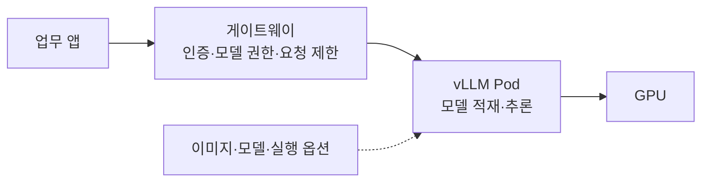
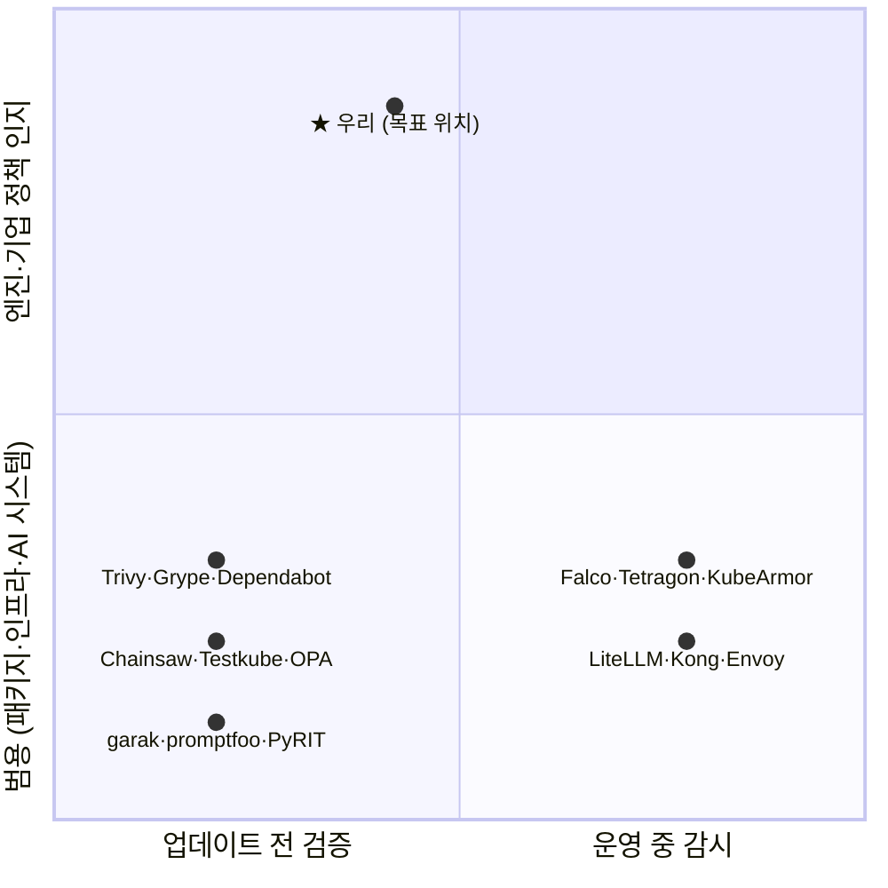
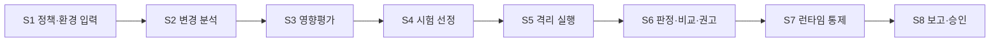

# LLM 서빙 엔진 업데이트 보안 검증 조사보고서

1차 발표용 조사보고서 · 번뜩번뜩 작은별 · 작성 기준일 2026-10-03 · **검토용 초안 v0.3 (2026-10-04)**

---

## 0. 요약

**문제.** 기업이 공개 모델을 직접 서비스하려면 vLLM 같은 서빙 엔진을 운영해야 한다. vLLM은 약 2주마다 새 릴리스가 나온다. 보안 권고도 2026년 상반기에만 23건 공개됐고, 7월부터 10월 초까지 36건이 더 나왔다. 같은 권고라도 모델 로딩 옵션, 사용 기능, 접근 경로에 따라 해당 여부가 달라진다. [R08~R11][R17][R67]

**As-Is.** 기업은 이미 "변경 검토 → 환경 영향 판단 → 시험 → 적용 결정 → 단계 배포 → 운영 확인·롤백" 절차로 엔진을 바꾼다(LinkedIn, 토스증권, NIST). 실무자 설문에서는 응답자 2명 모두 **"변경사항 중 검증이 필요한 항목 선별"**에 시간이나 전문적 판단이 많이 든다고 답했다. 업데이트 중에는 실제로 이런 일이 있었다. vLLM 0.20.0은 CI를 통과한 뒤에도 특정 모델·GPU 조합에서 장애를 일으켰고, 토스증권에서는 문제를 해결한 버전이 다른 성능 문제를 일으켰다. [R01][R02][R16][R51][T9][T10]

**정부 지침의 인식과 공백.** KISA 「AI 보안 위협 대응 매뉴얼」(2026-07)은 vLLM을 이름으로 언급하며 **"취약한 버전의 추론 엔진 사용"(S03)을 공급망 위협으로 분류**했다. 다른 지침도 업데이트 전 검증을 다룬다. 국정원 가이드북은 샌드박스·예비시스템에서 검증한 뒤 업데이트를 적용하라고 권고한다. KISA 안내서는 스테이징 시험, 회귀 테스트, 결과 보고서와 승인 절차를 점검 항목으로 둔다. 그러나 S03의 진단은 `pip-audit` 같은 버전 대조이고, 판정은 "패치된 버전이면 양호"다. 엔진 변경이 기업의 설정·정책에 해당하는지는 "사용 환경에 따른 영향 검토"로 기관에 맡긴다. 패치된 버전에서 보호 조건이 실제로 동작하는지 확인하는 시험 항목과 판정 기준은 없다. [R40][R41][R42]

**우리 위치.** 기존 지침의 일반 절차를 LLM 서빙 엔진에 맞게 실행 가능한 형태로 구체화하는 **보안 검증 프레임워크**를 만든다. 프레임워크가 하는 일은 셋이다.

- 엔진 권고·변경을 기업 배포 조건과 연결해 필요한 시험을 고른다.
- 두 버전을 같은 조건에서 실행하고, 그 증거로 판정한다.
- 검증한 정책을 운영 통제로 이어 간다.

기존 정책·시험·런타임 도구는 대체하지 않고 조합한다. 첫 대상은 vLLM이고, SGLang·TensorRT-LLM은 어댑터 확장 후보다. vLLM을 고른 이유는 시장점유율 1위이거나 가장 위험한 엔진이어서가 아니다. 공개 운영 사례, 배포 문서, 보안 권고와 수정 이력이 확보돼 있기 때문이다.

**업스트림 시험의 한계 (팀 실험).** 2026년 상반기 vLLM 보안 수정 17건에서 수정 조각을 하나씩 되돌려 보았다. 보안 조건을 깨뜨린 **호출형 변이 18개 중 14개를 기존 회귀 시험이 통과시켰다.** 그중 13개는 시험이 해당 호출 경로를 실행하지도 않았다. 회귀 시험을 통과했다고 해서 보안 수정이 유지된다고 볼 수 없다. [T12]

**남은 근거.** 설정 의존 권고 수 집계와 설문 추가 응답이 남아 있다. 이 자료를 확보하기 전에는 해당 비율, 설문 통계, 시간 절감률을 제시하지 않는다.

---

## 조사 범위와 근거 표시

공식 기술 블로그, 프로젝트 문서, 보안 권고, 정부 발행 자료를 중심으로 확인했다. 체계적 문헌고찰은 아니다.

외부 자료의 공통 확인일은 2026-10-03이다. 다음은 예외다.

- 1.2의 GitHub Star·Fork 수: 2026-09-24 확인값
- 권고 건수, 권고별 버전 필드, R51·R63 수치, 참고문헌 링크 접속: 2026-10-04 확인
- Runpod 수치: 수행계획서 재인용(원문 미확인)

팀이 제공한 기존 보안 도구 자료는 정적 코드 분석(T3)과 학습용 설정 예제(T4)다. 이 자료는 통제 범위와 연동 근거로만 쓴다. 실제 설치, GPU 성능, 차단 효과를 입증한 실험 결과로는 쓰지 않는다.

| 표시 | 의미 |
| --- | --- |
| [원문] | 공식 페이지·PDF 본문을 직접 확인 |
| [기사] | 언론 보도로만 확인 |
| [설문] | 팀 설문 응답(개인 의견, 폐쇄망 가정) |
| [팀자료] | 팀이 제공·작성한 조사 텍스트와 실험 기록. T 번호(T = Team)로 표시하며, 공개 출처는 R 번호로 표시한다 |
| [해석] | 확인된 사실을 연결한 팀의 분석 |
| [제안] | 앞으로 구현·평가할 설계 |
| [보류] | 원자료 미확보. 통계·조항·효과를 확정하지 않음 |

참고문헌 R 번호는 이 보고서의 번호다. 본문에서 수행계획서 번호를 쓸 때는 **v1.7 번호**로 통일한다. R 번호와 계획서 번호의 대응은 부록 E에 둔다.

---

## 1. 서빙 엔진 시장과 활용 현황

**핵심 메시지:** 공개 모델을 직접 서비스하려면 서빙 엔진 운영이 필요하다. vLLM은 그중 공개 자료, 운영 사례, 보안 이력이 가장 많이 확보된 엔진이다.

### 1.1 서빙 엔진의 역할

서빙 엔진은 모델을 GPU 메모리에 적재하고 추론 요청을 실행하는 소프트웨어다. vLLM은 요청 배치, KV 캐시·메모리 관리, 병렬 실행, OpenAI 호환 API를 제공한다. 역할을 나누면 모델 파일은 가중치와 설정, 엔진은 실행, 업무 시스템은 결과 활용을 맡는다. [R01][R03][R04]

일반적인 구성에서 요청은 업무 애플리케이션과 게이트웨이를 거쳐 추론 API로 전달된다. 권한 판단은 계층별로 나뉜다.

- 사용자·문서 권한: 업무 시스템
- 모델 호출 권한과 요청 제한: 게이트웨이
- Pod 접근 주소: Kubernetes Service

Kubernetes가 모든 모델 요청의 의미나 직원의 문서 권한을 판단하는 것은 아니다. 이 구성은 참조 구성이므로, Gateway나 데이터 저장소가 클러스터 밖에 있는 배치도 가능하다. 여러 노드가 한 추론에 참여하는 분산 구성은 통신·신뢰 경계를 따로 검토해야 한다. [R04][R05][R30][T2][T6]

### 1.2 주요 엔진과 지표

| 엔진 | 공식 자료상 역할 | GitHub Star·Fork (2026-09-24) | 이번 프로젝트 |
| --- | --- | --- | --- |
| vLLM | LLM 추론·서빙, K8s 배포 문서 | 약 92,600 · 22,600 | 첫 구현·평가 대상 |
| SGLang | LLM·멀티모달 고성능 서빙 | 약 36,400 · 9,100 | 후속 어댑터 후보 |
| TensorRT-LLM | NVIDIA GPU 추론 최적화 | 약 14,700 · 2,800 | 확장 후보 |
| LMDeploy | 모델 압축·배포·서빙 | 약 8,100 · 755 | 비교 대상 |

출처는 vLLM R66, SGLang R13, TensorRT-LLM R14, LMDeploy R15다. 수치는 수행계획서에 기록된 2026-09-24 확인값이다. [T8] 이 표는 공식 프로젝트의 기능 설명이며, 같은 조건에서 성능이나 보안성을 비교한 것이 아니다. 라이선스는 엔진, 모델, 의존 구성요소를 각각 확인해야 하므로 이 표만으로 기업 이용 가능성을 판정하지 않는다.

- **배포 지표:** vLLM 프로젝트는 2026년 7월 블로그에서 월 560만 회 이상의 pip 설치와 월 250만 회 이상의 컨테이너 이미지 다운로드를 밝혔다. [R51, 원문] Runpod는 자사 플랫폼 LLM 엔드포인트의 40%가 vLLM이라고 밝혔다. [계획서 v1.7 [12]를 T8에서 재인용, 발표 전 원문 재확인]
- **지표 해석:** Star는 관심, 설치 수는 설치 활동, 엔드포인트 비중은 한 플랫폼의 내부 집계다. 셋을 합쳐 시장점유율로 쓰지 않는다. vLLM 블로그의 "가장 널리 쓰이는 엔진"이라는 표현은 프로젝트 자체 주장이므로 인용하지 않는다.

### 1.3 공개 운영 사례

| 조직 | 활용 | 배포·변경 관련 근거 | 근거 범위 |
| --- | --- | --- | --- |
| LinkedIn (2025) | Hiring Assistant·AI Job Search 등 | 운영 버전과 새 버전·V1 엔진의 성능을 비교한 뒤 선택. gRPC 서버와 엔진 분리 [R01] | 해당 팀 운영 경험 [원문] |
| 토스증권 (2026) | ML 플랫폼 기반 LLM 배포·관측·튜닝 | 옵션·모델·설정 스트레스 테스트, 롤백 대비, CPU 스로틀링 사례 [R02] | 담당 엔지니어 설명 [원문] |
| Pinterest (2024) | Ray 기반 배치 추론 | vLLM 0.4.0 업그레이드 후 GPU 없는 노드에서 import 실패, 구조 분리 [R52] | 해당 팀 경험 [원문]. 초기 버전 시점의 사례 |
| vLLM Production Stack | K8s 운영 참조 스택 | 라우팅·배포·관측 참조 [R05] | 공식 참조 구성 [원문] |
| SGLang 채택 목록 | xAI·LinkedIn 등 | 조직별 구조는 미확인 [R13] | 프로젝트 소개 [원문] |

다음 사례는 계획서 v1.7 [3]·[4]·[6]·[8]·[9]·[10]에 출처와 근거 범위가 정리돼 있다. [T8] 발표 전에 원문을 다시 확인해 이 표에 추가한다.

- 서비스 운영 사례: Roblox, Amazon, 네이버, Red Hat
- 개발·평가 용도 사례: 카카오(모델 학습), 삼성전자(성능 평가). 표에 넣을 때 서비스 운영이 아님을 표시한다.

### 1.4 국내 공개 모델(독자 AI 파운데이션 모델)과 서빙 조건

국내 공개 모델의 공공 활용 사례가 나오고 있다.

- 2026-01: 정부가 공공 분야에서 독자 AI 파운데이션 모델을 우선 활용하는 방침을 밝혔다. [R60, 기사]
- 2026-05: 국방부가 A.X K1을, 과기정통부가 R&D 예산심의에 솔라 오픈을 활용한다고 발표됐다. [R61, 기사]
- 2026-08: 2차 단계평가에서 업스테이지·SKT·LG AI연구원이 3차에 진출했다. [R62, 원문]

공개 모델 다운로드도 이어지고 있다. 2026-09-21 기준 허깅페이스 최근 30일 다운로드는 다음과 같다. [R63, 기사] 다운로드 수는 실제 서빙 배포 수가 아니다.

- A.X K2: 약 13만 5천 회
- Solar-Open2-250B: 약 3,100회
- K-EXAONE 2.0: 약 2,000회

주요 공개 모델의 모델 카드는 모두 vLLM 또는 SGLang 서빙을 안내한다. [원문, 2026-10-03 확인]

| 모델 | 안내 엔진 | 기반 버전 | trust_remote_code | 출처 |
| --- | --- | --- | --- | --- |
| Solar-Open-100B | 업스테이지 vLLM Docker 이미지 | vLLM 0.12.0 | 필요 | R06 |
| Solar-Open2-250B | 업스테이지 vLLM 포크, SGLang | vLLM 0.22.0 | 불필요 | R58 |
| A.X K1 | 개인 계정 vLLM·SGLang 브랜치 | 명시 없음 | 명시 없음 | R59 |
| A.X K2 | SKT vLLM 포크, SGLang | vLLM 0.23.0 | 불필요 | R56 |
| K-EXAONE 2.0 | 개인 계정 vLLM·SGLang 브랜치 | 명시 없음 | 필요 | R57 |

**시사점 [해석]:** 국산 공개 모델을 직접 쓰면 서빙 엔진 운영이 따라온다. 확인할 것이 두 가지 늘어난다.

- 모델 카드가 업스트림이 아닌 특정 버전 기반 포크를 안내하므로, 업스트림 보안 수정이 포크에 반영됐는지 기업이 따로 확인해야 한다.
- 모델 카드가 원격 코드 실행 옵션을 요구하면, 기업의 금지 정책과 충돌하는지 검토해야 한다.

> **해석 범위**
>
> - 공공기관의 실제 자체 서빙 규모를 보여 주는 통계는 없다. "사례가 나오고 있다"까지만 말한다.
> - Solar 이미지의 기반 버전(0.12.0)은 업스트림 기준으로 CVE-2026-22807 영향 범위에 든다. 그러나 포크의 백포트 여부를 확인하지 않았으므로 취약하다고 단정하지 않는다.
> - 모델 카드의 하드웨어 요구(Solar-Open-100B: A100 80GB 4장 이상)는 해당 모델의 안내 조건이다.

---

## 2. 서빙 엔진 보안 위협 현황

**핵심 메시지:** 엔진 보안 문제는 버전, 설정, 사용 기능에 따라 성립 여부가 달라진다. 컨테이너·네트워크 통제만으로는 엔진 내부 보호 조건이 지켜지는지 확인할 수 없다.

### 2.1 권고 현황

vLLM 공식 보안 권고는 GHSA ID 기준으로 집계했다. [R67, GitHub 권고 API 집계, 2026-10-04 확인]

| 공개 기간 | 권고 수 |
| --- | --- |
| 2026년 1~6월 | 23건 |
| 2026-07-01 ~ 2026-10-04 | 36건 |

권고별 원표는 T12와 부록 B 기준으로 정리 중이다. 하반기 건수가 늘어난 원인은 분석하지 않았다. 일괄 공개 여부나 보고 경로 변화 등이 원인일 수 있으므로, 이 수치만으로 엔진이 더 위험해졌다고 해석하지 않는다.

Critical 등급 권고로는 영상 처리 RCE(2026-02)와 OpenAI API 인증 우회(2026-06)가 있다. [R10][R11]

### 2.2 대표 사례

| 권고 | 영향 조건 | 영향 / 수정 버전 | 검증과의 관계 |
| --- | --- | --- | --- |
| CVE-2026-22807 (GHSA-2pc9-4j83-qjmr), High | 모델 초기화 시 auto_map 동적 모듈 로딩에서 `trust_remote_code=False`가 적용되지 않음 | ≥0.10.1, <0.14.0 / 0.14.0 | 원격 코드 금지 정책이 로딩 경로에서 지켜지는가 [R08] |
| CVE-2026-27893 (GHSA-7972-pg2x-xr59), High | 특정 모델 구성요소에서 `trust_remote_code=True` 하드코딩 | ≥0.10.1 (상한 표기 없음) / 0.18.0 | 같은 정책이 모델별 구성요소에도 적용되는가 [R09] |
| CVE-2026-22778 (GHSA-4r2x-xpjr-7cvv), Critical | 영상 모델 입력 처리 | ≥0.8.3, <0.14.1 / 0.14.1 | 영상 기능을 쓰는 배포인가 [R10] |
| CVE-2026-48746 (GHSA-94f4-hr76-p5j6), Critical | OpenAI API 인증 처리 | ≥0.3.0 (상한 표기 없음) / ≥0.22.0 | 엔진 자체 인증과 앞단 게이트웨이 경로를 함께 확인 [R11] |

영향·수정 버전은 권고의 패키지 필드를 그대로 옮겼다(GitHub 권고 API, 2026-10-04 대조).

- GHSA-7972와 GHSA-94f4는 영향 필드에 상한이 없다. 실제 판정에는 수정 버전 필드, 수정 태그, 배포 이미지를 함께 확인해야 한다.
- 포크·벤더 이미지의 백포트 여부는 별도로 확인해야 한다. Solar 같은 벤더 이미지의 취약 여부를 기반 버전 문자열만으로 단정하지 않는다.

**[해석]** 네 사례는 해당 여부를 가르는 조건이 서로 다르다. 그래서 시험을 정책·설정·경로에 연결해야 한다.

- CVE-2026-22807, CVE-2026-27893: 기업이 정한 "원격 코드 금지"가 엔진 버전에 따라 지켜지거나 깨질 수 있다.
- CVE-2026-22778: 영상 기능을 쓰는지에 따라 해당 여부가 달라진다.
- CVE-2026-48746: 엔진에 도달하는 접근 경로에 따라 해당 여부가 달라진다.

### 2.3 컨테이너·네트워크 통제로 확인되지 않는 것

| 통제 계층 | 담당하는 것 | 이것만으로 확인되지 않는 것 |
| --- | --- | --- |
| 게이트웨이 (LiteLLM, Kong, Envoy) | API 접근, 모델 호출 권한, 요청 제한 | 우회 경로, 엔진 내부 동작 [R30][R31][R34] |
| Kubernetes 정책 (Kyverno) | 배포 리소스·admission | 실제 이미지·모델·옵션의 의미 [R22] |
| 네트워크 (NetworkPolicy, Cilium) | 연결·트래픽 제한 | 허용된 연결 안의 모델 로딩·요청 처리 [R07][R35] |
| 런타임 (Tetragon, KubeArmor, Falco) | 프로세스·파일 행위 관측·집행 | 이벤트와 엔진 정책 위반의 연결, 업데이트 전후 비교 [R25][R37][R38] |
| **엔진 버전별 시험 (우리)** | 선택한 보호 요구가 해당 버전·설정에서 지켜지는가 | 시험하지 않은 경로 [제안] |

CVE-2026-22807이 대표 예다. [R07][R08][R25]

- 외부 통신을 막으면 원격 코드의 **다운로드**는 막을 수 있다. 그러나 이미 배치된 모델 저장소 코드가 **로딩**되는 것은 막지 못한다.
- NetworkPolicy가 정상이어도 엔진이 `trust_remote_code=False`를 무시하면 그 정책은 지켜지지 않는다.
- 런타임 도구는 자식 프로세스 실행 같은 결과를 관측해 영향을 줄일 수 있다. 하지만 그 행위가 어떤 엔진 정책을 어긴 것인지는 따로 연결해야 한다.

도구별 범위를 과소평가하지 않는다. [R07][R35][R25][R37][R38]

- 표준 NetworkPolicy는 주로 IP·포트 수준의 규칙이고, 이를 집행하는 네트워크 플러그인이 필요하다.
- Cilium은 확장 정책으로 지원 범위의 L7 처리까지 제공한다. 그래서 네트워크 도구를 모두 L3·L4로 묶지 않는다.
- 런타임 도구도 엔진 내부 문제에 도움이 된다. 다만 경고 발생, 접근 거부, 프로세스 종료, Pod 삭제는 서로 다른 결과이므로 구분해서 기록한다.

### 2.4 내부 통신 권고의 적용 경계

GHSA-9pcc-gvx5-r5wm은 과거 V0 엔진의 다중 호스트 텐서 병렬 구성에 관한 권고이며, 본문은 V1이 영향을 받지 않는다고 명시한다. [R12]

엔진 내부 통신(ZMQ, KV 전송 등)의 이상 탐지는 **이번 범위에서 제외**한다. 엔진·버전별로 관측해야 하고, 다중 노드 구성을 전제하는 경우가 많기 때문이다. 내부 통신 포트의 노출 확인과 관련 권고의 콘텐츠 팩 추가는 선택 후보로 둔다(6.2).

### 2.5 팀 자체 분석: 회귀 시험은 보안 수정의 "호출 누락"을 잡는가 [T12, 팀 실험]

**질문.** 기업은 vLLM 업데이트 때 회귀 시험 통과를 보안 수정이 유지된다는 근거로 쓰곤 한다. 그런데 보안 수정은 두 부분으로 이루어진다.

1. 위험을 판단하는 보안 함수
2. 그 함수를 실제 요청 경로(라우터·처리기·로더)에서 부르는 호출

함수가 남아 있어도 호출이 빠지면 보호는 동작하지 않는다.

**용어.**

- **선정 시험:** 권고별로 고른 기존 회귀 시험 집합. CPU에서 실행해 통과하는 시험으로, 권고당 17~868개다.
- **동반 시험:** 보안 수정 PR에 함께 추가된 시험.
- **사용 지점 시험:** 보안 함수를 직접 부르지 않고, 실제 요청 경로를 거쳐 보호 조건을 확인하는 시험. 결과를 본 뒤 팀이 작성했다.

**방법.**

- 대상: 2026년 상반기 vLLM 권고 23건 중 17건. 다음 6건은 제외했다: Python 수정이 아닌 권고, 수정 커밋을 특정할 수 없는 권고, 시험을 실행할 수 없는 권고.
- 변이 생성: 수정이 처음 들어간 릴리스에서 수정 조각(hunk)을 하나씩 되돌려 **변이 78개**를 만들었다.
- 확인: 각 변이에서 (1) 선정 시험의 통과 여부와 (2) 권고별로 작성한 보안 조건 검사의 위반 여부를 함께 확인했다.

**결과.**

| 구분 | 위반 변이 | 선정 시험이 검출 | 통과(미검출) |
| --- | --- | --- | --- |
| 판단 로직형 (조건·비교·거부를 되돌림) | 4 | 4 | 0 |
| **호출형** (보안 함수 호출·보안 설정 전달을 되돌림) | **18** | 4 | **14** |
| 합계 | 22 | 8 | 14 |

- 78개 중 보안 조건 위반이 확인된 변이는 22개다. 나머지 56개는 비교에서 제외했다. 위반이 관찰되지 않은 변이가 31개, 판정할 수 없는 변이가 25개다.
- **미검출 14개 중 13개는 선정 시험이 되돌린 호출 줄을 한 번도 실행하지 않았다.** 그중 6개는 해당 파일을 불러오지도 않았다.
- 동반 시험은 보안 함수를 직접 부르기만 했다. 2pc9(CVE-2026-22807)와 7972(CVE-2026-27893)에는 동반 시험이 아예 없었다.
- 실제 요청 경로를 거치는 사용 지점 시험을 작성하자 미검출 14개를 모두 검출했다.
- 인위적 변이에서만 생기는 현상이 아니다. hgg8과 7972의 **실제 수정 전 릴리스**에서도 선정 시험은 모두 통과했다(31/31, 141/141). 반면 보안 조건 검사는 위반을 보고했다.
- 실제로 재발한 사례가 있다.
  - GHSA-hgg8: 앞선 수정 GHSA-4r2x의 정리 함수가 일부 응답 경로에서 호출되지 않아 다시 발행됐다.
  - GHSA-7972: 이전 수정 이후 다른 경로에 남은 같은 유형의 문제였다.

**프로젝트와의 연결 [해석].**

- "업스트림 회귀 시험 통과 = 보안 수정 유지"로 볼 수 없다는 **직접 근거**다. 2.3의 "엔진 버전별 보호 조건 시험"이 필요한 이유이기도 하다.
- 우리 시험(MODEL-007 등)은 보안 함수를 직접 부르지 않는다. **실제 모델 로딩·요청 경로**로 보호 조건을 확인하도록 설계하며, 이는 사용 지점 시험과 같은 원리다.
- 설문에서 토스증권 응답자가 고른 "공개 보안 수정 사례 중심으로 업데이트 후 해결 여부 확인"(3.4)을 그대로 수행한 실험이기도 하다.

**한계.**

- CPU에서 통과한 시험만 선정했으므로, GPU 경로나 제외된 시험이 검출했을 가능성이 있다.
- 판단 로직형과 호출형이 서로 다른 권고에서 나왔다. 그래서 유형 차이와 권고별 차이가 분리되지 않는다.
- 보안 조건 검사 일부는 예외 주입·함수 대체로 확인했다. 위반이 확인됐다고 해서 공격이 성공한다는 뜻은 아니다.
- 분류 기준과 사용 지점 시험은 결과를 본 뒤 작성했다.
- 원고는 ACK 2026 제출본이며, 게재 여부는 아직 확인 전이다.

**아직 세지 않은 것.** "설정·기능에 따라 해당 여부가 달라지는 권고 수"는 이 실험에서 집계하지 않았다. 23건 원표를 부록 B 기준으로 다시 분류해 채운다. 초기 보고서의 약 67건 집계 [T7]와는 기간과 선정 기준이 다르므로 비교하지 않는다.

> **해석 범위**
>
> - 권고 수는 GHSA ID 기준이다. 취약점 수나 릴리스 수가 아니다.
> - 2.2의 사례는 공식 권고의 설명이며, 팀이 기업 환경에서 재현한 결과가 아니다.
> - 시험이 없다는 사실만으로 수정이 실패했다고 판단하지 않는다.

---

## 3. 기업의 업데이트 실무 (As-Is)

**핵심 메시지 (As-Is):** 기업은 이미 검토 → 영향 판단 → 시험 → 적용 → 운영 확인 절차로 엔진을 업데이트한다. 그중 시간과 전문성이 많이 드는 일은 **변경사항에서 검증 항목을 고르고 보안 공지의 적용 여부를 판단하는 일**이다. 업데이트는 자주 필요하고, 공급자 시험을 통과해도 문제가 생긴다.

### 3.1 공개 사례로 본 업데이트 절차

| 단계 | 기업이 확인하는 것 | 근거 | 우리 프레임워크의 지원 |
| --- | --- | --- | --- |
| ① 변경 검토 | 릴리스·권고·의존성·지원 모델 변경 | NIST 식별·우선순위 [R16] | 변경 근거 정리 (S2) |
| ② 환경 영향 판단 | 활성 기능, 모델·옵션, 요청 경로, 기존 통제 | 설문 Q17 [T9][T10] | 적용성 판단 (S1·S3) |
| ③ 시험 계획·실행 | 보안 보호 요구, 기능, 성능 | LinkedIn 버전 비교 [R01], 토스 스트레스 테스트 [R02] | 시험 선정·두 버전 격리 실행 (S4·S5) |
| ④ 적용 결정 | 실패·미실행 시험, 예외, 운영 위험 | NIST 검증 [R16] | 판정·권고·보고서, 사람 승인 (S6·S8) |
| ⑤ 단계적 배포 | 트래픽 전환, 되돌림 준비 | 토스 롤백 대비 [R02] | 초기 범위 제외 |
| ⑥ 운영 확인 | 오류·지연·통제 유지 | 토스 관측 [R02] | 운영 통제·준수 상태 확인 (S7) |

각 기업의 실제 담당 조직, 업데이트 주기, 승인 체계는 추가 설문으로 확인한다(부록 A). 이 절차는 특정 기업의 내부 승인 흐름을 복제한 것이 아니다. 원문에 없는 카나리 단계나 보안 시험을 기업이 이미 수행한다고 덧붙이지 않는다.

### 3.2 업데이트 압력

- **릴리스 주기:** vLLM은 약 2주 간격의 정기 릴리스를 목표로 하고, 중대한 성능·기능·보안 문제에는 패치 릴리스를 낸다. 하위 호환성은 제한된 수의 minor 릴리스에서만 보장한다. [R17, 원문]
- **변경량:** 2026년 6월 한 달 동안 main 브랜치에 커밋 1,918개(하루 평균 64개)가 병합됐다. [R51, 원문]
- **보안 권고:** 2026년 상반기 23건, 7월 이후 36건(2.1).
- **배경 (AI로 빨라지는 취약점 발견):** Anthropic은 Mozilla와 협력해 2주 동안 Firefox 보안 버그 22건을 찾았다(2026-03). [R53] Google 위협 인텔리전스 그룹은 AI로 만든 것으로 판단한 제로데이 익스플로잇이 실제 공격에 쓰인 사례를 발표했다(2026-05). [R54, 기사] 소프트웨어 전반의 흐름이며, vLLM 권고 증가의 원인이라는 근거는 아니다.

**[해석]** 검토할 변경은 계속 생긴다. 그렇다고 기업이 매 릴리스마다 업데이트한다는 뜻은 아니며, 실제 적용 주기는 설문으로 확인한다.

### 3.3 업데이트 중 실제로 생긴 문제

| 사례 | 무슨 일이 있었나 | 시사점 | 출처 |
| --- | --- | --- | --- |
| vLLM 0.20.0 (2026) | 출시 후 특정 모델·GPU 조합에서 기능 장애와 처리량 저하가 발견돼 긴급 패치 2건을 냈다. 개발팀은 모든 시험을 통과해도 모델이 느려지거나 출력이 틀릴 수 있다고 밝혔다(번역 요지). | 공급자 CI 통과가 기업 조합의 정상 동작을 보장하지 않음 | R51 [원문]. 0.20.1·0.20.2 릴리스 노트(R18, R19)는 특정 모델·경로의 안정화와 오류 수정을 확인하는 용도로만 사용 |
| 토스증권 (2026) | 릴리스 노트상 문제를 해결한 버전을 적용한 뒤 CPU 스로틀링으로 느려졌다. 옵션·모델·설정을 스트레스 테스트하고 롤백에 대비했다. | 고친 버전이 다른 문제를 만들 수 있음 (성능 회귀) | R02 [원문] |
| Pinterest (2024) | vLLM 0.4.0 업그레이드 후 GPU 없는 Ray 헤드 노드에서 import가 실패했다. | 엔진 업데이트가 주변 플랫폼 구성에 영향 | R52 [원문] |
| vLLM 개발 측 (2026) | 고정되지 않은 의존성(FlashInfer)이 바뀌어 시험이 실패했고, 원인 파악에 시간이 걸렸다. PR별 시험 선택은 사람이 관리하는 대응표에 의존한다. | 엔진 개발 측에서도 "어떤 시험을 돌릴지" 선택이 수작업 | R51 [원문] |

위 사례는 기능·성능 회귀이며, 보안 회귀가 확인된 사례는 아니다. 보안 쪽 근거는 2.2의 권고 사례와 2.5의 실험이다.

### 3.4 실무자 설문 결과

**대상:** 삼성전자·토스증권 관계자 각 1명. 폐쇄망 사내 추론 환경을 가정한 **개인 의견**이며 회사의 공식 입장이 아니다. 응답일은 2026-09-28이다. [T9][T10]

| 문항 | 삼성전자 응답 | 토스증권 응답 |
| --- | --- | --- |
| Q17 업데이트 검토에서 시간·전문 판단이 많이 드는 작업 (최대 2) | **검증이 필요한 항목 선별**, 보안·성능·호환성 종합 적용 판단 | **검증이 필요한 항목 선별**, **보안 공지의 적용 조건과 영향 판단** |
| Q14 새 버전 적용 전 우선 검증 항목 (최대 3) | 외부 연결 요구 여부, 응답 품질, **보안 수정 적용·기존 보호 기능 유지** | 기존 클라이언트 호환, 응답 품질, **보안 수정 적용·기존 보호 기능 유지** |
| Q15 호환성 검증 우선 시험 (최대 3) | **API·관리 기능 접근 제한 유지**, 응답 형식, 도구 호출·구조화 출력 | 응답 형식, 도구 호출·구조화 출력, 실제 클라이언트 시나리오 |
| Q16 학생 프로젝트의 보안 회귀검증 접근 | 반복 항목은 자동화, 판단 항목은 수동 검토 | **공개 보안 수정 사례 중심으로 업데이트 후 해결 여부 확인** |
| Q18 실무에 유용한 산출물 (최대 2) | 위협 모델, **실행 절차가 포함된 보안 회귀 테스트 모음** | 위협 모델, **배포 점검 체크리스트** |
| Q13 업데이트 분석에 유용한 자료 | 보안 공지·CVE 정보 | 공개 테스트·벤치마크 결과 |
| Q20 결과 요약 수신 | 검토 가능 | 검토 가능 |

- 두 응답자 모두 **항목 선별**(Q17)과 **보안 수정 적용·보호 기능 유지 확인**(Q14)을 골랐다.
- 토스증권 응답자의 Q16 선택은 우리 1차 PoC 방식(공개 권고 CVE-2026-22807 기반 수정 검증)과 같다.
- **반대 방향 응답도 있다.** Q5(폐쇄망 위협 모델의 우선 위험)에서 두 응답자 모두 "설정 변경·업데이트 후 기존 보호 기능 누락"을 고르지 않았다. 우선 위험으로는 반입 모델·패키지 취약점, 로그 민감정보 노출, 권한 오용 등을 골랐다. 업데이트 회귀는 최우선 위협이라기보다 **업데이트할 때 확인해야 할 항목**으로 인식된다고 해석한다.
- Q13은 설문 폼 오류로 단일 선택만 가능했다.

**금융권 실무자 인터뷰 메모 [T11]:**

- 폐쇄망 구성이면 혁신금융서비스 신청 대상은 아니다. 다만 그 기준이 엄격해 참고할 만하다.
- 규제 완화와 함께 요구사항도 늘어나는 추세다.
- vLLM은 아직 내부의 간단한 서비스 위주로 쓰이지만 요구가 늘고 있다.
- 실무에는 **검토용 보고서, 체크리스트 항목, 시험 결과, 증적이 남는 형태**가 필요하다.

**[해석]** 표본 2명은 통계가 아니다. 다만 두 응답자가 "검증 항목 선별"이라는 같은 지점을 짚었다. 또 원하는 산출물(위협 모델, 회귀 테스트 모음, 체크리스트, 증적)이 우리 산출물 구성과 일치한다. 실제 업데이트 빈도, 인력, 시간은 이 설문에서 묻지 않았으므로 추가 설문으로 확인한다(부록 A).

### 3.5 설계에 반영하는 기준

| 가설 | 반영 | 하지 않을 약속 |
| --- | --- | --- |
| 적용 여부 판단이 어렵다 | 설정·기능·모델과 권고 조건 연결 (S1·S3) | 모든 권고 자동 판단 |
| 검증 항목 선별이 어렵다 | 공통 필수 + 변경 관련 시험 선정과 선정 이유 (S4) | 알려지지 않은 모든 경로 탐지 |
| 보호 기능 유지 확인이 필요하다 | 두 버전 같은 조건 비교 (S5·S6) | 엔진 버전만으로 원인 확정 |
| 증적이 남는 보고가 필요하다 | 영향평가 보고서·검증 결과 보고서 (S8) | 보안 승인 자동 대체 |

추가 응답에서 항목 선별이 주된 병목이 아니라고 나오면, 시험 실행 지원이나 보고서 기능의 비중을 높인다.

> **해석 범위**
>
> - 공개 사례는 기술적 필요성의 근거다. 수요와 효과는 설문 확대와 파일럿으로 확인한다.
> - "2주마다 릴리스"는 공급자의 릴리스 주기이지 기업의 업데이트 주기가 아니다.
> - 응답자의 시간 추정과 실제 측정 시간은 구분해 보고한다.

---

## 4. 관련 지침과 적용 경계

**핵심 메시지:** 지침은 업데이트 전 검증을 권고하거나 점검 항목으로 둔다. 그러나 서빙 엔진에 쓸 적용성 판단 기준, 시험 항목, 판정 기준은 정하지 않는다. 우리 도구는 지침과 경쟁하지 않고, 지침을 실행하는 일을 돕는다.

### 4.1 원문 확인한 조항

**국정원 「국가·공공기관 AI보안 가이드북」 (2025-12) [R40, PDF 본문 확인, 인쇄 쪽(PDF 쪽)]**

| 조항 | 내용 |
| --- | --- |
| T14 공급망 공격 | 운영 단계 위협: "최신 기능 · 데이터 업데이트 시 악성코드 유입" — 27쪽(28) |
| 사례 | "오픈소스 AI모델 운영 도구인 'Ollama'에 원격코드 실행이 가능한 취약점" — 21쪽(22) |
| M02 | 오픈소스 AI모델·라이브러리는 "배포자 전자서명과 해시값 검증 등을 통해 무결성을 검증하고, 필요 시 … 샌드박스 등 별도 환경에서 안전성을 확인하여 사용" — 34쪽(35) |
| M11 | 구성요소의 "출처, 버전, 변경이력, 해시값 등을 형상관리", "향후 AIBOM 등을 활용한 공급망 보안체계를 검토할 계획" — 36쪽(37) |
| M12 | 구성요소가 원본과 동일한지 서명·해시로 정기 검증 — 36쪽(37) |
| **M25** | "보안업데이트 과정에서 AI시스템의 오작동 등 발생 가능성에 대비, 실제 운영환경에서 발생 가능한 보안위협을 샌드박스 · 예비시스템 등을 활용하여 **정적 · 동적 검증 후 업데이트 적용 권고**" — 41쪽(42) |
| M25 점검표 | "취약점을 정기 점검하고, 발견한 취약점에 대해 보안패치 등 업데이트를 실시하였는가?" — 88쪽(89) |
| FAQ Q10 | "현재 오픈소스 AI모델의 보안성 · 안전성을 완벽하게 검증 · 확인하기는 어렵습니다" — 96쪽(97) |

**과기정통부·KISA 「인공지능(AI) 보안 안내서」 (2025-12, 2026-03 정오 수정본) [R41, PDF 본문 확인, 인쇄 쪽]**

| 조항 | 내용 |
| --- | --- |
| 1.2.2 | 위협·위험 평가(TRA): 기능 요구사항 검토 → 위협·취약점 식별 → 위험 분석·평가 → 통제 권장. 공격 표면에 "모델 업데이트 또는 재훈련 과정" 포함 — 31쪽 |
| 3.3 | 오픈소스 라이브러리: "변경 로그(Changelog)를 검토하여 보안 개선 사항을 확인", 샌드박스 실행, "원격 API 호출이나 외부 네트워크 액세스를 제한", 컨테이너 격리 — 48~49쪽 |
| **5.2.1** | 패치 관리 프로세스: "패치 필요성 평가: **취약점의 심각도 분석**", "실제 환경과 동일한 스테이징 환경 구축", "정적 분석, 동적 분석, **회귀 테스트 자동화**" — 64쪽 |
| **5.2.3** | "운영 체제, 라이브러리, 프레임워크의 보안 패치를 운영 환경에 적용하기 전에 스테이징 환경에서 패치를 테스트하고 있는가?" 확인 방법: "테스트 실행 결과 보고서", "테스트 결과 검토 및 승인 절차" — 65쪽 |
| 서비스 4.1 | "업데이트를 통해 다른 AI 연동에 영향을 미칠 것으로 예상되는 경우 위험에 대한 정보를 제공해야 함" — 96쪽 |
| 부록 | "AI 모델의 업데이트나 수정 사항을 사전에 검토하고, 잠재적인 보안 위험을 평가" — 221쪽 |

KISA 안내서 보도자료는 기존 지침들이 "보안 관점에서의 상세한 가이드 또는 기준은 제시되지 않았었다"고 밝힌다. [R41 보도자료]

### 4.2 지침에 있는 것과 없는 것 [해석]

| 지침에 있는 것 | 서빙 엔진에 쓰려면 비어 있는 것 | 우리 프레임워크가 채우는 것 |
| --- | --- | --- |
| 위험 평가 절차, 심각도 기반 패치 필요성 평가, S03 "사용 환경에 따른 영향 검토" | 엔진 권고가 **우리 설정·기능에 해당하는지** 판단하는 기준 | 정책·환경 입력과 적용성 판단 (S1·S3) |
| 스테이징 환경, 호환성·성능·회귀 테스트 | 엔진 업데이트 때 **무엇을 시험할지** (원격 코드 차단, 인증 범위, 외부 통신 등) | 공통 정책 5종에 연결된 시험 카탈로그, 시험 선정 (S4) |
| S03 판정: 패치된 버전이면 양호 | 패치된 버전에서 **보호 조건이 실제로 동작하는지** 확인 (2.5: 호출 누락은 회귀 시험을 통과) | 실제 경로 기반 보안 시험, 두 버전 비교 (S5·S6) |
| 테스트 결과 보고서, 승인, 감사 증빙 | **판정 기준과 증거 형식** (점검표는 Y/N) | PASS·FAIL·UNKNOWN 판정, 증거 SHA-256, 보고서 (S6·S8) |
| 구성요소 형상관리·무결성 검증·SBOM | 엔진 이미지·모델 revision·실행 옵션을 묶은 비교 단위 | 이미지 digest 기준 버전 비교 |

지침이 엔진을 다루는 방식은 시기별로 달라졌다.

- 2025년 12월 지침(국정원 가이드북, KISA 안내서)은 엔진을 라이브러리·프레임워크의 하나로 다뤘다.
- 2026년 7월 KISA 매뉴얼은 추론 엔진을 별도 위협(S03)으로 명시했다. 다만 진단과 판정은 여전히 버전 기반이다(4.3).

### 4.3 KISA 2026년 7월 후속 자료: 추론 엔진을 공급망 위협으로 명시

두 자료는 발간 당시 언론에서 AI 보안 "실무 참고서"로 소개됐다. [R65, 기사]

**과기정통부·KISA 「AI 보안 위협 대응 매뉴얼」 (2026-07) [R42, PDF 본문 확인, 인쇄 쪽]**

| 위치 | 내용 |
| --- | --- |
| 1장 개요 | 위협 범위에 "보안 패치가 미흡한 **추론 엔진·서빙 스택**의 취약점" 포함 — 15쪽. "운영 인프라"를 "추론 엔진, 서빙 스택, GPU, 네트워크, 호스팅 환경, 컨테이너" 등으로 정의 — 17쪽 |
| 2장 공급망 위협 개요 | "LLM 추론 엔진(**vLLM**, TensorRT-LLM, DeepSpeed Inference, llama.cpp 등)은 모델 실행 환경을 제공하는 핵심 구성요소이므로, 취약한 버전이나 검증되지 않은 구성을 사용할 경우 서비스 장애, 임의 코드 실행, 리소스 고갈 등의 위험으로 이어질 수 있다" — 39쪽 |
| **[S03] 취약한 버전의 추론 엔진 사용** | 정의: "보안 패치가 적용되지 않은 구버전의 추론 엔진이나 라이브러리를 사용하여 실행 과정에서 보안 취약점이 발생하는 위협". 원인: 의존성 관리 미흡, 패치 미적용 배포. 영향: 정보 노출, 악성코드 실행, 서비스 중단, 권한 탈취 — 46쪽 |
| 진단 체크리스트 | S03: "사용 중인 추론 엔진 또는 런타임에 알려진 보안 취약점이 존재하는지 정기적으로 점검하는가" (Y/N) — 20쪽 |
| S03 대응 방안 | "자산 목록화 및 정기적 보안 업데이트" — 129쪽 |
| 2.3 오픈소스 정기적 보안 업데이트 | 취약점 모니터링(CVE, GitHub Security Advisory), 위험도 평가(심각도·영향 범위), 패치 주기, 긴급 패치, **"반영 전 샌드박스 및 스테이징에서 호환성·성능·회귀 테스트 수행"**, CI/CD 자동화, 롤백, 패치·테스트 결과 기록, 감사 증빙 — 150쪽 |
| 부록 S03 진단 방법 | `pip show vllm`으로 의존성 확인, `pip-audit`으로 설치 패키지의 알려진 취약점 확인. 평가 기준: **[양호] 보안 패치가 적용된 버전의 추론 엔진을 사용 / [취약] 적용되지 않은 버전 사용**. 대응: 최신 패치 적용, "최신 패치가 존재하지 않을 경우, 사용 환경에 따라 미칠 수 있는 영향 검토", 입력 검증, 신뢰 출처 모델, SBOM — 207~208쪽 |

**과기정통부·KISA 「AI 보안 레드티밍 가이드」 (2026-07) [R43, PDF 본문 확인, 인쇄 쪽]**

| 위치 | 내용 |
| --- | --- |
| 레드티밍 대상 | "AI 모델에 한정되지 않으며" 데이터·모델·애플리케이션·**인프라 계층(서버 및 컨테이너, CI/CD 파이프라인, 접근 제어)** 포함 — 11~12쪽 |
| 위협 분류 | 공급망 위협 **S03 취약한 버전의 추론 엔진 사용** 포함 — 13쪽 |
| 수행 시기 | 모니터링 단계 활동에 "**모델 업데이트 후 재검증**" — 16쪽 |
| 후속 조치 | 패치 후 "재검증"(기존 공격 재수행, 우회 공격)과 "회귀 테스트"(정상 질의, 성능 벤치마크) 병행 — 44~45쪽 |
| 체크리스트 | 로그 수집(입력·출력·**모델 버전**·시스템 프롬프트 버전·도구 호출 등), 증적 확보, 결과 판정 — 50쪽 |

**[해석] 무엇이 달라졌나**

- **당위성이 강해졌다.** 2026년 7월부터 정부 지침이 vLLM을 이름으로 언급하고, 취약한 버전의 추론 엔진 사용을 독립된 공급망 위협(S03)으로 분류했다. "서빙 엔진 업데이트가 보안 문제인가"라는 질문에 공식 근거로 답할 수 있다.
- **그러나 진단·판정 방법은 버전 기반이다.** S03의 진단은 `pip-audit` 같은 버전·취약점 대조이고, 판정은 "패치된 버전이면 양호"다. 2.5의 팀 실험은 수정된 버전의 회귀 시험이 보안 수정의 호출 누락을 놓칠 수 있음을 보였다. 설정·기능에 따른 해당 여부는 "사용 환경에 따라 미칠 수 있는 영향 검토"로 기관에 맡긴다.
- **레드티밍 가이드의 재검증·회귀 테스트는 모델 행동 중심이다.** 재검증은 공격 프롬프트 재주입이고, 회귀 테스트는 정상 질의와 성능 벤치마크다. 엔진 버전을 바꿨을 때 원격 코드 로딩, 인증 범위 같은 엔진 보호 조건을 확인하는 시험 항목은 없다.
- SW 공급망 보안 가이드라인 1.0 [R44]은 SBOM·구성요소 관리의 배경으로만 사용한다.

### 4.4 금융분야

- **금융위원회(2026-04-15):** 생성형 AI **모델**을 변경할 때 보안 영향을 사전 점검한 서면확인을 내면 혁신금융서비스 변경 절차를 간소화한다. [R45] 대상은 모델 변경이므로 서빙 엔진 업데이트에는 직접 적용되지 않는다. 보고서 구성의 참고로만 쓴다.
- **금융보안원:**
  - 2026-01: AI 평가 프레임워크 개발·시범 방향을 발표했다. [R46]
  - 2026-08 보도: 하반기 시범검증 후 2027년부터 본격 평가하고, 영향도별로 정기 재검증(고영향은 반기 등)한다고 소개됐다. [R64, 기사] 기사에는 서빙 엔진·SW 업데이트 항목이 명시되지 않았다.

> **해석 범위**
>
> - 지침에 "방법이 없다"는 뜻이 아니다. "일반 절차는 있으나 엔진용 구체 기준이 없다"는 뜻이다.
> - 국정원 M25는 "권고"이고, KISA 5.2.3은 점검 항목이다. 이 보고서는 지침의 법적 효력이나 기관별 적용 여부를 판단하지 않는다.

---

## 5. 유사 솔루션과 오픈소스 비교

**핵심 메시지:** 정책 평가, 취약점 검사, 시험 실행, 런타임 관측은 기존 도구에 이미 있다. 우리 차별점은 기능이 없어서 만드는 것이 아니다. **엔진 권고·변경을 기업 배포 조건과 연결해 시험을 고르고, 같은 정책 기준으로 버전별 증거를 남기는 것**이다. 이것이 수동 검토 부담을 실제로 줄이는지는 평가로 확인한다.

### 5.1 비교 방법

다음 기준으로 공식 문서의 공개 범위를 정리했다.

- 대상과 입력
- 기본 제공 기능
- 사용자가 직접 작성해야 하는 부분
- 결과·증거

설치해서 시험한 결과가 아니다. 문서에 없다는 이유로 기능이 없다고 단정하지 않는다.

### 5.2 패키지·정책·시험 실행 도구

| 도구 | 대상·입력 | 확인한 기능 | 엔진 검증에 추가로 필요한 것 |
| --- | --- | --- | --- |
| Trivy | 이미지·패키지, VEX | 알려진 취약점, VEX 상태 기반 필터 | 엔진 설정 기반 해당 여부, 실행 시험 [R20] |
| Grype | 이미지·파일시스템·SBOM | 알려진 취약점 검사 | 엔진 동작·배포 경로 해석 [R32] |
| Dependabot | 저장소 의존성 | 취약 의존성 업데이트 PR | 이미지·모델·배포 시험 [R33] |
| OPA | 구조화 데이터·정책 | 범용 정책 판단 | 환경 수집과 시험·집행 연결 [R21] |
| Kyverno | K8s 리소스·정책 | 정책 검증·관리 | 엔진 기능의 의미와 실제 결과 [R22] |
| Chainsaw | YAML 시험·단언 | K8s 시험, JUnit 보고 | 엔진 시험 시나리오와 판정 [R23] |
| Testkube | 시험 Workflow·이벤트 | 시험 실행·보고, Kyverno 연동 사례 | 엔진별 권고 조건·시험 콘텐츠 [R24] |

Testkube+Kyverno 연동 사례처럼 **정책 입력 + 자동 시험 + 보고의 조합 자체는 이미 있다.** 그래서 평가(6.5)에서는 기존 조합에 같은 시험 콘텐츠를 넣은 경우와도 비교한다.

Trivy의 VEX 처리는 외부에서 제공한 영향 상태 주장을 활용하는 기능이다. 기업의 모든 vLLM 설정을 독립적으로 분석하거나 수정을 검증하는 기능으로 설명하지 않는다. 반대로 기존 도구가 적용 여부를 전혀 다루지 않는다고 주장하지도 않는다.

### 5.3 AI 시스템 시험과 게이트웨이

| 도구 | 확인한 대상·기능 | 구분할 부분 |
| --- | --- | --- |
| garak | 챗봇·모델 시스템의 원치 않는 동작 검사 | 출력 동작 평가 vs 엔진 내부 보호 요구 [R26] |
| promptfoo | 모델 API·RAG·에이전트 레드팀, 사용자 정책 | API 시험은 가능, 엔진 버전·설정 해석은 사용자 몫 [R27] |
| PyRIT | 다양한 AI 시스템 대상 시나리오·점수·기록 | 확장 기능과의 중복 확인 [R28] |
| ModelScan | 모델 직렬화 파일의 위험 코드 | 모델 파일 검사 vs 엔진 실행 경로 [R29] |
| LiteLLM, Kong, Envoy AI Gateway | 모델 연결·키·접근·트래픽 관리 | 요청 정책 집행 vs 업데이트 수정 검증 [R30][R31][R34] |

garak·promptfoo·PyRIT을 모델만 보는 도구로 일괄 분류하지 않는다. promptfoo와 PyRIT은 실제 API·애플리케이션에 사용자 정책과 확장 로직을 적용할 수 있다. 그래서 같은 조건을 줬을 때 사용자에게 남는 작업이 얼마나 되는지를 비교한다. 비교할 작업은 엔진 버전·모델 로딩 설정·배포 경로를 권고·시험 결과와 연결하는 일이다. [R26][R27][R28]

### 5.4 런타임 도구와 우리의 활용

| 역할 | 기존 도구 | 우리 프로젝트에서 |
| --- | --- | --- |
| 요청 경계 | Envoy·OPA, LiteLLM | 게이트웨이로 재사용 (S7) [R21][R34] |
| 이미지·배포 검사 | Trivy, Kubescape, Kyverno | 결과를 증거로 수집 [R20][R22][R36] |
| 통신 통제·조회 | Cilium·Hubble | 외부 통신 차단·확인(NET-004)에 활용 [R35][R47] |
| 런타임 행위 | Tetragon, Falco, KubeArmor, Tracee | 프로세스·파일 행위 관측 (탐지·기록) [R25][R37][R38][R48] |
| 경고 이후 대응 | Falco Talon | 대응 결과를 참고만 하고, 초기 자동 대응은 구현 제외 [R39] |

**상용 제품.** Oligo, Protect AI, HiddenLayer 등은 공식 문서의 공개 범위를 확인한 뒤 비교표에 넣는다. 특히 Oligo는 런타임 맥락 연결 기능이 이전 팀 아이디어와 겹친다는 기록이 있다. [T5] 따라서 런타임 맥락 연결을 우리만의 기능으로 설명하지 않는다.

**엔진 생태계·운영 스택.** 다음 세 가지는 배포·라우팅·운영 구조를 이해하기 위한 비교 대상이다. [R05][R49][R50]

- vLLM Production Stack
- KServe: Kubernetes 추론 플랫폼
- llm-d: Kubernetes 기반 분산 추론 스택

이들이 운영 기능을 제공한다는 사실과, 선택한 보안 보호 요구를 버전별로 검증하는 기능은 구분한다. 이들에 보안 기능이 없다고 판정하지 않는다. Ray Serve, Red Hat AI Inference, Snyk 등은 추가 비교 후보다. 공식 문서의 공개 범위와 에디션을 확인하기 전에는 비교표에 "없음"을 적지 않는다. [T1][T7]

### 5.5 포지셔닝

★ 우리 (목표 위치): 엔진 권고 × 배포 조건 → 시험 선정 → 버전 비교 → 증거

**[해석]** 기존 도구가 주로 다루는 대상은 다음과 같다.

- 패키지: SCA 도구
- 인프라: 정책·런타임 도구
- AI 시스템의 응답 동작: AI 레드팀 도구

이 도구들을 조합하면 엔진 업데이트를 검증할 수 있다(5.2 Testkube+Kyverno, 5.3 promptfoo·PyRIT의 사용자 정책). 다만 우리가 본 공식 문서 범위에서는 두 가지 작업이 사용자 몫으로 남는다.

- 엔진 권고를 기업 배포 조건에 대응시키는 일
- 어떤 보호 조건을 어느 경로에서 시험할지 정하는 일

우리는 이 작업을 줄이는 위치를 목표로 한다. 실제로 줄어드는지는 6.5의 A·B·C 비교로 확인한다. 이 그림은 기존 도구에 해당 기능이 없다는 증명이 아니라, 문서 범위에서 정리한 상대적 위치다.

### 5.6 차별성을 검증할 비교 기준 [제안]

우리가 제안하는 차별성은 두 가지를 하는 것이다.

- 엔진의 권고·변경 이력과 기업 배포 조건을 연결해, 적용 여부와 시험 선택 이유를 설명한다.
- 버전별 실행 증거를 같은 정책 기준으로 정리한다.

이를 두 층으로 나누어 평가한다.

1. **시험 콘텐츠**의 가치: 엔진별 조건과 보호 요구를 정리한 자료 자체의 효과
2. **프레임워크**의 추가 이점: 같은 콘텐츠를 쓰더라도 입력 정규화, 시험 선정, 실행, 증거 보고를 연결해서 얻는 이점

기존 실행기에 우리 시험 콘텐츠를 넣은 결과와도 비교해, 콘텐츠의 효과를 프레임워크의 효과로 돌리지 않는다.

| 비교 항목 | 판정할 질문 | 문서 비교 단계의 기록 방식 |
| --- | --- | --- |
| 정책 입력 | 어떤 형식의 요구와 조건을 받는가 | 기본 제공 / 사용자 작성 / 확인 보류 |
| 적용 판단 | 버전·모델·기능·접근 조건을 해석하는가 | 외부 주장 활용과 독립 판단 구분 |
| 실제 시험 | 어떤 요구를 어떤 경로에서 확인하는가 | 지원 범위와 사용자 확장 구분 |
| 전후 비교 | 비교 조건과 변경 요소를 기록하는가 | 기본 기능 / 연동 / 확인 보류 |
| 증거 보고 | 원자료·실패·미실행 이유를 남기는가 | 자동 생성과 사용자 정리 구분 |

> **해석 범위**
>
> - 비교는 공식 문서 기준이며, 설치해서 시험한 결과가 아니다.
> - 확인하지 못한 칸은 "확인 안 됨"으로 둔다. 경쟁 도구의 부재를 증명한 것처럼 쓰지 않는다.

---

## 6. 시사점과 설계 반영

### 6.1 조사 결과 → 설계 결정

| 조사 결과 | 장 | 설계 결정 | 파이프라인 단계 |
| --- | --- | --- | --- |
| 같은 권고도 설정·기능·경로에 따라 해당 여부가 다름 | 2.2 | 정책·환경 입력과 적용성 판단 | S1 정책·환경 입력, S3 영향평가 |
| 실무자는 검증 항목 선별이 어렵다고 응답 | 3.4 | 공통 필수 + 변경 관련 시험 자동 선정, 선정·제외 이유 기록 | S4 시험 선정 |
| 회귀 시험이 보안 수정의 호출 누락을 놓침 | 2.5 | 보안 함수 직접 호출이 아닌 실제 경로 기반 시험 | S4, S5 |
| CI 통과 후에도 조합별 문제 발생 | 3.3 | 기업 조건으로 두 버전 격리 실행·비교 | S5 격리 실행, S6 판정·비교·권고 |
| 지침은 결과 보고서·승인을 점검하고, 실무자는 증적이 필요 | 4.1, 3.4 | 영향평가 보고서(시험 전)·검증 결과 보고서(시험 후), 사람 승인 | S8 보고·승인 |
| 네트워크 통제만으로 엔진 내부 보호 조건 확인 불가 | 2.3 | 엔진 버전별 보호 조건 시험 + 운영 통제 | S5, S7 런타임 통제 |
| 국산 모델이 엔진 포크·원격 코드 옵션을 안내 | 1.4 | 이미지 digest·모델 revision·실행 옵션을 비교 단위로 기록 | S1, S5 |
| 정책·시험·보고 조합은 기존에도 있음 | 5.2 | 기존 도구 재사용, 엔진별 시험 콘텐츠와 연결 로직에 집중 | 콘텐츠 팩 |
| 모델 제공자가 vLLM 포크와 SGLang을 함께 안내 | 1.4 | 엔진 어댑터 구조 | 확장 단계 |

### 6.2 구현 범위 (개발 계획 기준)

**파이프라인 S1~S8**

**공통 정책 5종**

1. 모델 코드 실행 금지
2. 정상 동작 유지
3. 외부 통신 차단
4. 성능 유지
5. 인증·관리 API 접근 제한

**콘텐츠 팩:** CVE별 권고, 분석 규칙, 시험 자료를 데이터로 분리해 코어에 특정 CVE를 고정하지 않는다. 첫 팩은 CVE-2026-22807이다.

**1차 시험**

| 시험 ID | 확인 내용 |
| --- | --- |
| MODEL-007 | 원격 코드 미실행 |
| FUNC-003 | 정상 로딩·응답 |
| SYS-001·002 | 프로세스·파일 행위 |
| PERF-001 | 성능 |
| NET-004 | 외부 통신 차단 |
| GW | 게이트웨이 시험 |

**런타임 통제 (S7) 4구성**

1. **게이트웨이(필수):** 인증·경로·모델 규칙을 위반한 요청을 엔진에 전달하기 전에 거부한다. 정책 평가에 오류가 나면 차단한다(fail-closed).
2. **엔진 직접 접근 제한:** 비승인 Pod의 직접 호출을 거부한다. 게이트웨이를 내린 상태에서 엔진에 도달할 경로가 없는지 확인한다.
3. **외부 통신 차단과 상태 확인** (NET-004)
4. **프로세스·파일 행위 탐지·기록:** 차단 여부는 관측·호환성 시험 후 결정한다.

**초기 대상 환경**

- Linux의 단일 노드 vLLM 배포다. 한 복제본이 자체적으로 추론을 완료하는 구성을 말한다.
- 노드의 GPU 수와 모델·의존성 조건은 시험마다 명시한다. 복제본 간 공유 상태나 분산 추론 전체를 검증했다고 확대하지 않는다.
- Kubernetes는 기업 조건의 참조 배포 환경으로 쓴다. 준비·로딩 단계만으로 가능한 항목과 실제 GPU 추론이 필요한 항목을 나눈다.

**판단 보조 에이전트(선택):** 설명과 초안만 제안한다. 에이전트 사용 여부와 관계없이 판정 결과는 같다.

**비목표:** 엔진 내부 control-plane 이상 탐지, 다중 노드, 멀티모달, 동적 LoRA, 운영 배포·롤백 자동화, 보안 승인 자동화

**선택 후보:** NET-004의 내부 통신 포트·허용 피어 확인 확장, 내부 통신 권고 콘텐츠 팩

### 6.3 기록하는 입력

| 구분 | 항목 | 이유 |
| --- | --- | --- |
| 배포 식별 | 기준·후보 이미지 digest, 엔진 버전·commit, 포크 여부 | 비교 단위는 엔진 이미지 digest |
| 모델 식별 | 모델·토크나이저·설정 revision 또는 해시 | 같은 이름의 다른 내용 구분 |
| 실행 환경 | GPU·드라이버·CUDA·의존성, 실제 실행 옵션 | 환경 차이 해석. 버전 외 조건이 다르면 비교 불가 |
| 요청과 통제 | 활성 기능, 접근 경로, 게이트웨이·네트워크·런타임 정책 | 도달 조건과 기존 보호 구분 |
| 기업 정책 | 공통 정책 선택·값·예외, 확정 상태(DRAFT/CONFIRMED) | 판단 기준 |

### 6.4 판정 상태 (팀 공통 판정 규칙 v1.0)

| 대상 | 상태 | 원칙 |
| --- | --- | --- |
| 정책 확정 | DRAFT / CONFIRMED | DRAFT는 공식 판단 기준으로 쓰지 않음 |
| 정책 적용 범위 | APPLICABLE / NOT_APPLICABLE / EXEMPTED / UNKNOWN | 예외(EXEMPTED)여도 변경 영향은 기록 |
| 변경 영향 | APPLICABLE / NOT_APPLICABLE / UNKNOWN | 정보 부족은 UNKNOWN |
| 시험 | PASS / FAIL / UNKNOWN | UNKNOWN을 PASS로 올리지 않음. 미실행·EXAMPLE 데이터는 실측 결과로 표시하지 않음 |
| 버전 비교 | NO_CHANGE / REGRESSION / FIXED / EXISTING_FAILURE / BEHAVIOR_CHANGED / INCONCLUSIVE | 실행 조건이 버전 외에 다르면 INCONCLUSIVE |
| 권고 | ELIGIBLE / MANUAL_REVIEW / BLOCKED | 자동 권고는 승인이 아님 |
| 승인 | PENDING / APPROVED / REJECTED | 정책·예외·릴리스 승인 구분 |
| 데이터 출처 | EXAMPLE / MEASURED | 모든 결과에 표시 |
| 검증 수준 | ENGINE / PARTIAL_PATH / STATIC | 모든 결과에 표시. 증거는 SHA-256으로 식별 |

검증 수준의 뜻은 다음과 같다.

- **ENGINE:** 실제 엔진을 실행해 대상 경로 전체에서 확인했다.
- **PARTIAL_PATH:** 경로의 일부에서만 확인했다(예: 준비·로딩 단계까지만).
- **STATIC:** 코드·설정을 정적으로 분석해서만 확인했다.

판정을 해석할 때 지킬 원칙은 다음과 같다.

- 통신 시도가 없었던 결과는 차단 성공이 아니다. 실행 표식이 없다는 것만으로 PASS가 아니다.
- 현재 버전은 비교 대상일 뿐, 안전성이 입증된 기준 정답이 아니다. 같은 문제가 두 버전에서 반복되면, 정책을 충족한 것이 아니라 같은 실패가 확인된 것일 수 있다(EXISTING_FAILURE).
- 시험 통과는 선택한 조건·경로에서 지정한 요구가 충족됐다는 뜻이다. 선정하지 않은 경로, 관측 누락, 다른 모델·장비·옵션까지 안전하다는 보장이 아니다.

**증거에 포함하는 것 [제안]**

- 입력과 실제 실행 설정
- 이미지·모델 식별자
- 정책·콘텐츠 팩 버전
- 시험 ID·입력
- 로그·이벤트·결과 원본
- 시간과 timeout
- 정상 대조 결과
- 미실행·보류 이유

민감한 입력과 키는 마스킹한다. 외부 AI 평가기를 쓰는 시험은 데이터 전송 위치, 비용, 비결정성을 명시한다.

### 6.5 평가 방법

| 평가 | 방법 | 기록 |
| --- | --- | --- |
| 적용 판단 | 독립 검토한 정답과 비교 | 잘못된 NOT_APPLICABLE, UNKNOWN 비율 |
| 시험 선정 | 개발에 쓰지 않은 사례에서 기준 시험 목록과 비교 | 필수 시험 누락, 불필요 선정, 근거 오류 |
| 판정·비교 | 정상·위반·증거 누락 사례(골든 사례) | 오판, UNKNOWN 처리, 회귀·개선 분류 |
| 런타임 통제 | 정상·위반 요청, 직접 접근, 외부 통신 | 정상 요청 오차단 수·비율, 차단 확인 |
| 성능 영향 | 같은 조건 두 버전, 게이트웨이 전후 | TTFT·지연·처리량·오류율·자원 |
| 작업 부담 | A 수동 절차 / B 기존 도구 조합 + 같은 시험 콘텐츠 / C 제안 프레임워크 | 단계별 실제 시간·수동 작업량 |
| 신뢰성 | 공개 기술 보고서 기반 시험환경 프로필 3~4종, 기업 파일럿의 독립 검토 | 환경별 동작 여부, 담당자 검토 의견 |

평가를 공정하게 하기 위한 원칙은 다음과 같다.

- **정답 구성:** 가능하면 서로 다른 검토자가 권고, 설정, 실행 경로를 검토해 합의한다. 구현에 쓴 사례와 효과를 평가할 사례를 분리한다.
- **집계:** UNKNOWN을 NOT_APPLICABLE로 계산하지 않고, 미실행 시험을 통과에 넣지 않는다.
- **실행 조건:** 모델, 입력, 정책, 장비를 가능한 한 고정한다. GPU가 부족해 두 버전을 순차로 시험할 때는 실행 순서, 워밍업, 캐시, 부하 조건을 통제하고 반복 결과의 변동을 보고한다.
- **효과 분리:** 콘텐츠의 효과와 프레임워크의 효과를 나누기 위해, B와 C에 같은 시험 자료를 제공한다.

B는 시간이 허락하는 범위에서 수행한다. 절감률이나 정확도의 수치 목표는 파일럿으로 기준선을 확인한 뒤 정한다.

### 6.6 추진 순서와 축소 기준

**추진 순서**

1. 설문·인터뷰와 권고 원표 검증을 먼저 진행하고, 기존 도구 조합 기준선을 준비한다.
2. 제한된 보호 요구에 대해 입력·시험·보고 연결을 구현하고 파일럿을 수행한다.
3. 신규 엔진 확장은 연결과 증거 구조가 유용하다는 것이 확인된 뒤 판단한다.

**축소 기준**

| 상황 | 대응 |
| --- | --- |
| 기존 도구 조합으로도 충분하고 추가 이점이 작음 | 시험 콘텐츠와 보고서 제공 중심으로 축소 |
| 환경 정보 확보가 어려워 잘못된 NOT_APPLICABLE을 막기 어려움 | 자동 판정보다 검토 지원에 집중 |
| GPU·호환성 재현 비용이 과도함 | 지원 모델·버전·정책 수를 줄임 |

**결론.** vLLM을 첫 대상으로, 기업 정책·배포 조건과 업데이트 시험·증거를 연결하고 이를 운영 통제까지 잇는 보안 검증 프레임워크를 개발한다. 수요와 효과는 설문 확대와 파일럿으로 입증하고, 기존 도구 대비 추가 가치는 비교 평가로 입증한다.

---

## 참고문헌

**번호와 확인일 기준**

- R 자료의 내용 확인일은 2026-10-03이다. 링크 접속은 2026-10-04에 모두 다시 확인했다.
- R 번호는 v0.1을 그대로 유지했다(R01~R50). v0.2에서 추가한 자료는 R51부터 이어 붙였고, R55는 결번이다. R66은 v0.2 복원 때, R67은 v0.3에서 추가했다.
- 수행계획서 v1.7 번호와의 대응은 부록 E에 둔다.

**공식 기술 글·문서 (엔진 활용·배포)**

- [R01] LinkedIn Engineering — How we leveraged vLLM to power our GenAI applications (2025-08-26).
  - 근거 범위: 공식 기술 글 본문 확인. 해당 팀의 운영·버전 비교 경험.
  - https://www.linkedin.com/blog/engineering/ai/how-we-leveraged-vllm-to-power-our-genai-applications
- [R02] 토스 기술 블로그(토스증권) — LLM 서빙 띄우는 것과 잘 띄우는 것 사이 (2026-08-21).
  - 근거 범위: 공식 글 본문 확인. 담당자의 스트레스 테스트·롤백·CPU 스로틀링 설명.
  - https://toss.tech/article/tech_talk_talk_2
- [R03] vLLM — Security.
  - 근거 범위: 공식 보안 문서 확인. 배포·내부 통신의 신뢰 경계. 권고 목록이 아님(권고 목록은 R67). 게시일 미확인.
  - https://docs.vllm.ai/en/latest/usage/security/
- [R04] vLLM — Using Kubernetes.
  - 근거 범위: 공식 배포 문서 확인. Deployment·Service·모델 저장 등 참조 구성. 게시일 미확인.
  - https://docs.vllm.ai/en/latest/deployment/k8s/
- [R05] vLLM — Production Stack.
  - 근거 범위: 공식 README 확인. Kubernetes 기반 운영 참조 스택.
  - https://github.com/vllm-project/production-stack
- [R06] Upstage — Solar Open 100B 모델 카드.
  - 근거 범위: 제공자 카드 확인. 모델 실행 안내, GPU, 원격 코드 신뢰 옵션. 모든 모델의 조건을 대표하지 않음.
  - https://huggingface.co/upstage/Solar-Open-100B
- [R07] Kubernetes — Network Policies.
  - 근거 범위: 공식 문서 확인. 표준 NetworkPolicy의 범위와 플러그인 의존.
  - https://kubernetes.io/docs/concepts/services-networking/network-policies/

**vLLM 보안 권고**

- [R08] vLLM — GHSA-2pc9-4j83-qjmr / CVE-2026-22807, High (2026-01-21).
  - 근거 범위: 공식 권고의 영향 조건·패키지 버전 확인. 기업 배포에서 재현한 것이 아님.
  - https://github.com/vllm-project/vllm/security/advisories/GHSA-2pc9-4j83-qjmr
- [R09] vLLM — GHSA-7972-pg2x-xr59 / CVE-2026-27893, High (2026-03-26).
  - 근거 범위: 공식 권고의 모델별 신뢰 설정, 영향·수정 버전 확인. 영향 필드에 상한 없음.
  - https://github.com/vllm-project/vllm/security/advisories/GHSA-7972-pg2x-xr59
- [R10] vLLM — GHSA-4r2x-xpjr-7cvv / CVE-2026-22778, vLLM RCE In Video Processing, Critical (2026-02-02).
  - 근거 범위: 공식 권고의 영상 모델 조건, 영향·수정 버전 확인. 재현 아님.
  - https://github.com/vllm-project/vllm/security/advisories/GHSA-4r2x-xpjr-7cvv
- [R11] vLLM — GHSA-94f4-hr76-p5j6 / CVE-2026-48746, OpenAI API Auth Bypass, Critical (2026-06-02).
  - 근거 범위: 공식 권고 확인. 영향 필드와 수정 필드를 구분해 기재.
  - https://github.com/vllm-project/vllm/security/advisories/GHSA-94f4-hr76-p5j6
- [R12] vLLM — GHSA-9pcc-gvx5-r5wm, Multi-Node Cluster Configuration (2025-05-06).
  - 근거 범위: 공식 권고 확인. V0·다중 호스트 조건, V1 비영향 설명.
  - https://github.com/vllm-project/vllm/security/advisories/GHSA-9pcc-gvx5-r5wm
- [R67] vLLM — Security Advisories 목록 (GitHub Security Advisories).
  - 근거 범위: 2026년 상반기 23건, 2026-07-01~10-04 36건을 GitHub 권고 API(`/repos/vllm-project/vllm/security-advisories`)로 집계. 공개일(published_at) 기준. 계획서 v1.7 [34]와 같은 자료. 2026-10-04 확인.
  - https://github.com/vllm-project/vllm/security/advisories

**엔진 프로젝트·릴리스·절차**

- [R13] SGLang — 공식 저장소.
  - 근거 범위: 공식 README의 기능과 채택 조직 목록 확인. 기업별 배포는 독립 검증하지 않음.
  - https://github.com/sgl-project/sglang
- [R14] NVIDIA — TensorRT-LLM 공식 저장소.
  - 근거 범위: 공식 README 확인. 추론 최적화와 runtime 구성요소.
  - https://github.com/NVIDIA/TensorRT-LLM
- [R15] InternLM — LMDeploy 공식 저장소.
  - 근거 범위: 공식 README 확인. 모델 압축·배포·서빙.
  - https://github.com/InternLM/lmdeploy
- [R16] NIST — SP 800-40 Rev. 4, Guide to Enterprise Patch Management Planning (2022-04-06).
  - 근거 범위: 공식 발행 페이지 요약 확인. 패치 관리의 식별·우선순위·확보·설치·검증.
  - https://csrc.nist.gov/pubs/sp/800/40/r4/final
- [R17] vLLM — Releasing vLLM.
  - 근거 범위: 공식 문서 확인. 2주 릴리스 목표와 제한된 minor 버전 하위 호환.
  - https://docs.vllm.ai/en/latest/contributing/release_process/
- [R18] vLLM — v0.20.1 Release Notes (2026-05-04).
  - 근거 범위: 공식 노트 확인. DeepSeek V4 안정화와 특정 경로 수정.
  - https://github.com/vllm-project/vllm/releases/tag/v0.20.1
- [R19] vLLM — v0.20.2 Release Notes (2026-05-10).
  - 근거 범위: 공식 노트 확인. 특정 모델·실행 조합의 오류 수정.
  - https://github.com/vllm-project/vllm/releases/tag/v0.20.2

**비교 대상 도구 (5장)**

- [R20] Aqua Security — Trivy v0.64 VEX Overview.
  - 근거 범위: 버전을 지정한 공식 문서 확인. VEX 상태 기반 취약점 결과 필터.
  - https://trivy.dev/docs/v0.64/guide/supply-chain/vex/
- [R21] Open Policy Agent — Documentation.
  - 근거 범위: 공식 문서 확인. 구조화 데이터와 정책 판단, 집행과 분리.
  - https://www.openpolicyagent.org/docs
- [R22] Kyverno — Introduction.
  - 근거 범위: 공식 문서 확인. 정책 검증·관리의 공개 기능 범위.
  - https://kyverno.io/docs/introduction/
- [R23] Kyverno — Chainsaw.
  - 근거 범위: 공식 문서 확인. YAML 시험·단언, JUnit 보고, CI 연계.
  - https://kyverno.github.io/chainsaw/main/
- [R24] Testkube — Orchestrating Policy-Driven Test Automation with Testkube and Kyverno (2025-09-17).
  - 근거 범위: 공식 연동 사례 확인. 정책 이벤트와 시험 실행·보고.
  - https://testkube.io/blog/policy-driven-test-automation-with-testkube-and-kyverno
- [R25] Tetragon — Policy Enforcement.
  - 근거 범위: 공식 문서 확인. 지원 커널 함수 지점의 관측·집행.
  - https://tetragon.io/docs/getting-started/enforcement/
- [R26] garak — Welcome to garak.
  - 근거 범위: 공식 개요 확인. 챗봇·모델 사용 시스템의 행동 검사와 보고.
  - https://docs.garak.ai/garak
- [R27] promptfoo — How to red team LLM applications.
  - 근거 범위: 공식 가이드 확인. API·RAG·에이전트 대상, 사용자 정책.
  - https://www.promptfoo.dev/docs/guides/llm-redteaming/
- [R28] Microsoft — PyRIT 1.0.1 Documentation.
  - 근거 범위: 버전을 지정한 공식 개요 확인. AI 시스템 대상, 시나리오·점수·기록.
  - https://microsoft.github.io/PyRIT/1.0.1/
- [R29] Protect AI — ModelScan.
  - 근거 범위: 공식 README 확인. 모델 직렬화 파일의 위험 코드 검사.
  - https://github.com/protectai/modelscan
- [R30] LiteLLM — Virtual Keys.
  - 근거 범위: 공식 문서 확인. 키·모델 접근·사용량 관리.
  - https://docs.litellm.ai/docs/proxy/virtual_keys
- [R31] Kong — AI Gateway.
  - 근거 범위: 공식 제품 개요 확인. 개별 기능의 에디션·플러그인은 추가 확인 필요. 문서 사이트 이전에 따라 URL 갱신.
  - https://developer.konghq.com/ai-gateway/
- [R32] Anchore — Grype.
  - 근거 범위: 공식 README 확인. 이미지·파일시스템·SBOM 취약점 검사.
  - https://github.com/anchore/grype
- [R33] GitHub — About Dependabot security updates.
  - 근거 범위: 공식 문서 확인. 취약 의존성 업데이트 PR. 문서 경로 이전에 따라 URL 갱신.
  - https://docs.github.com/en/code-security/concepts/supply-chain-security/dependabot-security-updates
- [R34] Envoy — Envoy AI Gateway 공식 저장소.
  - 근거 범위: 클라이언트와 GenAI 서비스 사이의 트래픽 처리.
  - 기존 문서 도메인(aigateway.envoyproxy.io)이 2026-10-04 기준 다른 도메인(theagentrouter.ai)으로 리다이렉트되어 저장소 URL로 교체했다. 프로젝트 이름 변경 여부는 확인 필요.
  - https://github.com/envoyproxy/ai-gateway
- [R35] Cilium — Overview of Network Policy.
  - 근거 범위: 공식 문서 확인. 표준·확장 정책과 지원하는 L3·L4·L7 범주.
  - https://docs.cilium.io/en/stable/security/policy/
- [R36] Kubescape — 공식 저장소.
  - 근거 범위: 공식 README 확인. 구성·위험·컴플라이언스·런타임 범위 소개.
  - https://github.com/kubescape/kubescape
- [R37] Falco — The Falco Project.
  - 근거 범위: 공식 개요 확인. 이벤트 규칙 기반 탐지·경고와 전달.
  - https://falco.org/docs/
- [R38] KubeArmor — Documentation.
  - 근거 범위: 공식 개요 확인. 지원 LSM 기반 시스템 접근 정책 집행.
  - https://docs.kubearmor.io/kubearmor
- [R39] Falco — Falco Talon 공식 저장소.
  - 근거 범위: 공식 README 확인. Falco 이벤트 수신 후 대응.
  - https://github.com/falcosecurity/falco-talon

**지침·제도 (4장)**

- [R40] 국정원 — 국가·공공기관 AI보안 가이드북 (2025-12, 국가인공지능전략위원회 게시).
  - 근거 범위: **PDF 본문 확인**. 인쇄 쪽(PDF 쪽) 병기.
  - https://aikorea.go.kr/web/board/brdDetail.do?menu_cd=000011&num=144
- [R41] 과기정통부·KISA — 인공지능(AI) 보안 안내서 (2025-12, 정오 수정 2026-03-13).
  - 근거 범위: **정오 수정본 PDF 본문 확인**, 인쇄 쪽 기준. 보도자료(2025-12-10) 확인.
  - https://www.kisa.or.kr/2060204/form?lang_type=KO&postSeq=19
- [R42] 과기정통부·KISA — AI 보안 위협 대응 매뉴얼 (2026-07, 등록 2026-07-07).
  - 근거 범위: **PDF 본문 확인**, 인쇄 쪽 기준(S03 46쪽, 2.3 150쪽, 부록 S03 207~208쪽).
  - https://www.kisa.or.kr/401/form?postSeq=3712
- [R43] 과기정통부·KISA — AI 보안 레드티밍 가이드 (2026-07, 등록 2026-07-07, ISO/IEC AWI TS 42119-7 참고).
  - 근거 범위: **PDF 본문 확인**, 인쇄 쪽 기준.
  - https://www.kisa.or.kr/401/form?postSeq=3713
- [R44] KISA — SW 공급망 보안 가이드라인 1.0 (등록 2024-05-13).
  - 근거 범위: 공식 발행 페이지 확인. 첨부는 최종 수정본이며 최초 발표일과 구분.
  - https://www.kisa.or.kr/2060204/form?page=1&postSeq=15
- [R45] 금융위원회 — 생성형 AI 활용을 위한 혁신금융서비스 지정 절차 간소화 (2026-04-15).
  - 근거 범위: 공식 보도자료 본문 확인. 생성형 AI 모델 변경 관련 제도 범위.
  - https://www.fsc.go.kr/no010101/86712
- [R46] 금융보안원 — 금융 AI의 신뢰성과 안전성 강화를 위한 핵심 AI 전략 추진 (2026-01-02).
  - 근거 범위: 공식 발표 확인. 평가 프레임워크 개발·시범실시 방향. 2027 의무 시행의 근거는 아님.
  - https://www.fsec.or.kr/bbs/detail?bbsNo=11872&menuNo=69

**런타임·생태계 보조 자료**

- [R47] Cilium — Network Observability with Hubble.
  - 근거 범위: 공식 문서 확인. 노드·클러스터 네트워크 흐름 관측과 조회.
  - https://docs.cilium.io/en/stable/observability/hubble/
- [R48] Aqua Security — Tracee.
  - 근거 범위: 공식 저장소 개요 확인. Linux eBPF 런타임 보안·포렌식.
  - https://github.com/aquasecurity/tracee
- [R49] KServe — 공식 개요.
  - 근거 범위: 공식 사이트 확인. Kubernetes 추론 플랫폼과 배포·라우팅 기능.
  - https://kserve.github.io/website/
- [R50] llm-d — 공식 개요.
  - 근거 범위: 공식 사이트 확인. Kubernetes 기반 분산 추론 스택.
  - https://llm-d.ai/

**v0.2 이후 추가**

- [R51] vLLM — Keeping vLLM Production Quality: A Look Inside CI, Benchmarking, and the Release Process (2026-07-16).
  - 근거 범위: 0.20.0 긴급 패치 2건, 의존성 문제, 수동 시험 대응표, 2주 릴리스. 월 560만+ pip 설치, 월 250만+ 이미지 다운로드. 2026년 6월 커밋 1,918개.
  - https://vllm.ai/blog/2026-07-16-keeping-vllm-production-quality
- [R52] Pinterest Engineering — Ray Batch Inference at Pinterest (Part 3) (2024-10-30).
  - 근거 범위: vLLM 0.4.0 업그레이드 후 import 문제. Medium이 자동 요청을 차단(403)하므로 브라우저로 확인할 것.
  - https://medium.com/pinterest-engineering/ray-batch-inference-at-pinterest-part-3-4faeb652e385
- [R53] Anthropic — Partnering with Mozilla to improve Firefox's security (2026-03).
  - https://www.anthropic.com/news/mozilla-firefox-security
- [R54] The Hacker News — Hackers Used AI to Develop First Known Zero-Day 2FA Bypass for Mass Exploitation (2026-05).
  - 근거 범위: Google 위협 인텔리전스 그룹 발표를 다룬 보도. [기사] Google 원문으로 교체 권장.
  - https://thehackernews.com/2026/05/hackers-used-ai-to-develop-first-known.html
- [R56] SK텔레콤 — A.X-K2 모델 카드.
  - https://huggingface.co/skt/A.X-K2
- [R57] LG AI연구원 — K-EXAONE-2.0-750B-A37B 모델 카드.
  - https://huggingface.co/LGAI-EXAONE/K-EXAONE-2.0-750B-A37B
- [R58] Upstage — Solar-Open2-250B 모델 카드.
  - https://huggingface.co/upstage/Solar-Open2-250B
- [R59] SK텔레콤 — A.X-K1 모델 카드.
  - https://huggingface.co/skt/A.X-K1
- [R60] 머니투데이 — '독파모 AI' 대신 '챗GPT' 쓰려는 공공기관, 정부 허가받아야 (2026-01-28).
  - 근거 범위: [기사] 정부 원문(보도자료·정책브리핑)으로 교체 예정.
  - https://www.mt.co.kr/tech/2026/01/28/2026012818512627665
- [R61] 다음 뉴스 — '독파모' 모델들 공공 투입… 국방 AI 만들고 R&D 예산 짠다 (2026-05-14).
  - 근거 범위: [기사] 포털 재게재본. 언론사 원문 URL로 교체 예정.
  - https://v.daum.net/v/20260514181948875
- [R62] 정책브리핑 — 독자 AI 파운데이션모델 프로젝트 2차 단계평가 결과.
  - https://www.korea.kr/briefing/policyBriefingView.do?newsId=156774781
- [R63] 전자신문 — SKT, 독파모 13만 다운로드로 확산 선도…업스테이지·모티프 순 (2026-09-21).
  - 근거 범위: [기사] 허깅페이스 최근 30일 다운로드 수치. 다운로드 수는 배포 수가 아님.
  - https://www.etnews.com/20260921000277
- [R64] 한국금융신문 — 금융보안원 AI 평가체계 (2026-08-12).
  - 근거 범위: [기사]
  - https://www.fntimes.com/html/view.php?ud=2026081213031636551b5a221379_18
- [R65] 머니투데이 — 과기정통부·KISA, AI 보안 '실무 참고서' 발간 (2026-07-08).
  - 근거 범위: [기사] R42·R43 발간 보도.
  - https://www.mt.co.kr/tech/2026/07/08/2026070809202658998
- [R66] vLLM — 공식 저장소 (vllm-project/vllm).
  - 근거 범위: 1.2 표의 vLLM Star·Fork 출처. 수행계획서 v1.7 [13]과 같은 자료.
  - https://github.com/vllm-project/vllm

**팀 자료**

- [T1] 1차 발표용 조사 보고서 작성 틀 (기준 2026-10-03). v0.1 작성 시점에는 계획서·ACK·설문 원자료가 첨부되지 않았고, v0.2에서 T8~T12로 확보했다.
- [T2] 기업의 vLLM 환경 준비와 요청 흐름. 참조 운영·배포 설명이며, 실제 기업 구축 시험 결과가 아니다.
- [T3] 보안 스택 11개 오픈소스의 주소·기능·코드 동작 방식. 정적 소스 분석과 고정 커밋 기록이다. 배포 버전의 지원 범위는 재확인이 필요하다.
- [T4] 회사 구현 기능과 오픈소스별 설정 예제. 학습용·오프라인 검증 예제이며, 실운영 배포·차단 실증이 아니다.
- [T5] M0~E5 관측 계층과 도구. 계층별 관측 역할과, 기존 런타임 아이디어·제품과의 중복 검토.
- [T6] 기업 Kubernetes의 서비스 배치와 보안 계층. 용어, 연결, 관측, 판단, 집행의 구분.
- [T7] AI Inference Infrastructure 및 vLLM 보안 초기 조사보고서 (기준 2026-09-12). 초기 가설과 약 67건 잠정 집계. 원표는 미첨부이며 최종 결론이 아니다.
- [T8] 수행계획서 (v1.3 2026-10-01, 최신 v1.7). 엔진 지표와 기업 사례의 출처다. 본문에서 계획서 번호는 v1.7 기준으로 쓰며, 대응은 부록 E에 있다.
- [T9] 삼성전자 관계자 설문 응답 PDF (2026-09-28). 개인 의견, 폐쇄망 가정.
- [T10] 토스증권 관계자 설문 응답 PDF (2026-09-28). 개인 의견, 폐쇄망 가정.
- [T11] 금융권 실무자 인터뷰 메모 (팀원 기록).
- [T12] 김민기·신가영·이도하·허영조 — 「vLLM 보안 수정에서 보안 함수 호출 누락에 대한 회귀 시험의 검출 한계 연구」. ACK 2026 제출 원고 v34와 실험 자료(rq23: 변이 78개 결과, rq_table.csv, UPDATE_v6.md). 게재 여부 미확인.

---

## 부록 A. 설문지

배포용 설문은 별도 파일로 관리한다.

| 파일 | 대상 | 분량 | 비고 |
| --- | --- | --- | --- |
| `설문지_수정본_v2.txt` | 신규 응답자(운영·보안 공통) | 필수 9문항, 약 5~7분 | — |
| `후속설문_기존응답자용_보안담당자판.txt` | 기존 응답자(보안 담당자) | 8문항, 약 3분 | 업데이트 빈도·인력 같은 운영 수치는 묻지 않고, 운영팀 소개를 요청한다 |

**모집 대상:** 서빙 엔진을 운영하거나 변경 검증을 담당하는 실무자다. 규모·업종이 다른 담당자 3~5명을 추가로 인터뷰하는 것은 초기 탐색 목표이며, 대표성 있는 통계 표본으로 설명하지 않는다. 응답 원문, 인용문, 조직명 공개 여부는 각각 동의를 받는다.

**결과 정리 기준**

- 응답자 수, 모집 방법, 응답 기간을 적는다.
- 미응답과 판단 불가를 구분한다.
- 인용에는 개인 의견과 배포 가정을 표시한다.
- 적은 표본의 비율을 일반화하지 않는다.

## 부록 B. 권고 원표와 시험 분석 기준

| 항목 | 기준 |
| --- | --- |
| 식별자 | GHSA를 행 단위로, CVE는 연결 식별자 |
| 기간 | 최초 공개일 2026-01-01~06-30 (R67에서 23건 확인) |
| 날짜·버전 | 최초 공개·수정일, 영향·수정 버전 |
| 조건 | 공격자 입력·모델·권한·접근 경로, 활성 기능, 기존 통제 |
| 분류 | 주 유형 1개 + 복수 태그, 심각도 출처 |
| 설정 의존성 | 정의된 조건 기준으로 판정, 불명확하면 보류 |
| 수정·시험 | 수정 commit, 시험 파일, 보호 요구·입력·단언 |
| 증거 상태 | 원문 / 정적 분석 / 실행 확인 / 해석 구분 |
| 검토 | 독립 검토자, 불일치와 합의 이유 |

분모는 세 가지로 따로 기록한다: 전체 권고, 조건 분류가 가능한 권고, 실행 가능한 권고. 복수 유형 합계는 전체 수보다 클 수 있다.

## 부록 C. 발표 전 근거 보완 목록

| 우선순위 | 자료 | 상태와 다음 조치 |
| --- | --- | --- |
| 완료 | ACK 원고 v34·rq23 실험 결과 | 2.5 반영 |
| 완료 | KISA 2026-07 위협 대응 매뉴얼·레드티밍 가이드 PDF | 4.3 반영 (S03, 2.3 오픈소스 업데이트, 레드티밍 재검증) |
| 완료 | 권고 건수 출처 (R67) | 상반기 23건 확인, 7월 이후 36건 반영 (2.1) |
| 완료 | pip 설치·이미지 다운로드 수치 원문 | R51 원문 확인, 1.2 반영 |
| 완료 | 참고문헌 링크 접속 확인 | R31·R33·R34 URL 갱신 |
| 1 | 권고 23건의 설정 의존 여부 분류 | 부록 B 기준으로 집계해 2.5 보완 |
| 1 | 추가 설문 응답 | 부록 A 설문 발송, 3.4 갱신 |
| 2 | Roblox·Amazon·네이버 등 사례 원문 | 1.3 표 확장 (계획서 v1.7 [3]~[10]) |
| 2 | Runpod 수치 원문 | 1.2 재확인 (계획서 v1.7 [12]) |
| 2 | Google 위협 인텔리전스 원문 | R54 교체 |
| 2 | R60·R61 원문 | 정부 보도자료, 언론사 원문 URL로 교체 |
| 2 | R52 Pinterest 글 | 브라우저로 열어 내용 재확인 |
| 2 | Envoy AI Gateway 이름·도메인 변경 여부 | R34 확인 |
| 2 | 계획서 [29]~[30]과 R60·R61·R63의 중복 여부 | 부록 E 갱신 |
| 3 | 상용 제품 공개 기능 범위 | 5.4 비교 확장 |

## 부록 D. 1차 발표 구성 (10분, 멘토 지정 구성 기준)

| 순서 | 시간 | 내용 | 보고서 근거 |
| --- | --- | --- | --- |
| 1 | 3분 30초 | **배경·당위성:** 서빙 엔진과 vLLM(1장) → 권고가 설정마다 다르고 네트워크 통제로 확인 안 됨(2장) → As-Is 절차와 병목·설문(3장) → 지침의 일반 절차와 빈 곳(4장) | 1.4 표, 2.2 표, 2.5 표, 3.1 절차도, 3.4 설문 표, 4.2 표 |
| 2 | 1분 | 기존 도구와의 위치 | 5.5 포지셔닝 그림 |
| 3 | 1분 | 산출물: 점검 프레임워크(정책 체크리스트·시험 카탈로그·판정 기준) + 도구 | 6.2 |
| 4 | 1분 30초 | 아키텍처: S1~S8, 런타임 4구성 | 6.2, 6.4 |
| 5 | 1분 30초 | PoC: CVE-2026-22807 기반 정책 확정 → 영향평가 → 시험 선정 → 시험 전 보고서 (EXAMPLE 데이터, 실측 전 표시) | 6.1 |
| 6 | 1분 | 한 달 진척(WBS, task 기준)과 향후 계획: 10/15 스모크 실측, 평가·파일럿, 엔진 확장 | 6.5, 6.6 |

합계는 9분 30초이며, 30초는 전환·질문 대비 여유로 둔다. 설문 수치, 권고 비율, 효과 수치는 확보 전에는 발표 화면에 넣지 않는다. 3.2의 "AI로 빨라지는 취약점 발견"은 배경 자료이므로 시간이 부족하면 발표에서 생략한다.

## 부록 E. 수행계획서 참고문헌 번호 대응 (v1.7 기준)

이 보고서의 R·T 번호와 수행계획서 v1.7 참고문헌 번호의 대응이다. URL이 같으면 "동일", 같은 출처의 다른 쪽이면 "유사"로 표시했다. 발표 슬라이드는 계획서 번호를 쓰므로 이 표로 맞춘다.

| 이 보고서 | 계획서 v1.7 | 비고 | 이 보고서 | 계획서 v1.7 | 비고 |
| --- | --- | --- | --- | --- | --- |
| R01 LinkedIn | [5] | 동일 | R40 국정원 가이드북 | [38] | 동일 |
| R02 토스 2026 | [42] | 동일 | R41 KISA 안내서 | [39] | 동일 |
| R03 vLLM Security | [17] | 동일 | R42 KISA 위협 대응 매뉴얼 | [40] | 동일 |
| R06 Solar 모델 카드 | [31]~[33] | 리비전 지정본 | R43 KISA 레드티밍 가이드 | [41] | 동일 |
| R07 NetworkPolicy | [20] | 동일 | R51 vLLM 블로그 | [11] | 동일 (1.2 설치 수치 출처) |
| R08 CVE-2026-22807 | [35] | 동일 | R52 Pinterest | [43] | 동일 |
| R13 SGLang | [14] | 동일 | R56 A.X-K2 | [46] | 동일 |
| R14 TensorRT-LLM | [15] | 동일 | R57 K-EXAONE 2.0 | [47] | 동일 |
| R15 LMDeploy | [16] | 동일 | R66 vLLM 저장소 | [13] | 동일 |
| R16 NIST | [44] | 동일 | R67 vLLM 권고 목록 | [34] | 동일 (계획서는 API 주소) |
| R17 릴리스 문서 | [45] | 동일 | T9 삼성전자 설문 | [36] | 내부 자료 |
| R21 OPA | [24] | 유사(Envoy 연동 쪽) | T10 토스증권 설문 | [37] | 내부 자료 |
| R23 Chainsaw | [22] | 동일 | T12 ACK 원고 | 번호 없음 | 계획서 본문에서 서술 |
| R24 Testkube | [23] | 유사(Test Workflows 쪽) | R25 Tetragon | [25] | 유사(enforcement 문서 쪽) |

**보고서에만 있는 것:** R04, R05, R09~R12, R18~R19, R20, R22, R26~R39, R44~R50, R53~R54, R58~R65.

R60·R61·R63은 계획서 [29]~[30](독파모 기사)과 같은 기사일 수 있으므로 확인 후 이 표를 갱신한다.

**계획서에만 있는 것:**

- [1] PagedAttention
- [2]·[7] 토스증권 2024 글
- [3] Roblox, [4] Amazon, [6] 네이버, [8] 카카오, [9] 삼성반도체, [10] Red Hat
- [12] Runpod
- [18] GHSA-wpww
- [19] 멀티테넌시
- [21] BPF LSM
- [26] pytest
- [27]~[28] 이슈·PR
- [29]~[30] 독파모 기사

이 자료를 1.3의 기업 사례 확장 등에 쓸 때는 "계획서 v1.7 [n]"과 [T8]로 인용한 뒤 원문을 확인한다.

## 부록 F. 변경 이력

| 판 | 날짜 | 주요 변경 |
| --- | --- | --- |
| v0.1 | 2026-10-03 | 초안 |
| v0.2 | 2026-10-04 | 참고문헌 복원, ACK 실험(2.5)·KISA 2026-07 자료(4.3) 반영 |
| v0.3 | 2026-10-04 | 아래 항목 |

v0.3의 변경 내용은 다음과 같다.

- **권고 목록 출처:** R67(권고 목록)을 추가했다. 요약·2.1의 권고 건수 출처를 R03에서 R67로 바로잡았다.
- **권고 건수:** 7월 이후 권고를 36건으로 확정했다(기존 "6건 이상 [보류]").
- **권고 버전·식별자:** GHSA-7972 영향 범위를 권고 필드대로 고쳤다. GHSA-4r2x·94f4에 CVE ID를, 대표 사례에 심각도를 추가했다.
- **링크 갱신:** R31·R33의 URL을 이전된 주소로 갱신했다. R34는 문서 도메인이 리다이렉트되어 저장소 URL로 교체했다. R52에는 접속 메모를 달았다.
- **인용 정리:** 본문에서 인용하지 않던 R63(1.4 다운로드 수치)과 R65(4.3 발간 보도)를 본문에 연결했다.
- **설치 수치:** 1.2의 pip·이미지 수치를 R51 원문으로 직접 인용했다. 3.2에 R51의 커밋 수를 추가했다.
- **계획서 번호:** v1.7로 통일하고 T8 설명을 갱신했다.
- **표현 강도:** 요약과 4장의 지침 표현을 "요구"에서 "권고·점검 항목"으로 낮췄다.
- **포지셔닝:** 5.5의 해석을 5.2·5.3·5.6의 신중한 서술과 맞췄다("비어 있다"는 단정 삭제).
- **용어 정의:** 2.5에 선정 시험·동반 시험·사용 지점 시험을 정의했다. 6장의 내부 코드(B6, A1)를 풀어 쓰고, 검증 수준(ENGINE/PARTIAL_PATH/STATIC)을 정의했다.
- **6.1 근거 보강:** 엔진 어댑터의 근거를 1.4로 바꾸고, 2.5 실험 결과 행을 추가했다.
- **팀자료 번호:** U1~U12를 T1~T12(T = Team)로 바꿨다.
- **기타:** 사례 연도 표기, 번역 표시, 확인일 예외, 발표 시간 합계 메모를 추가했다.

## 용어

- **적용 판단:** 권고의 영향 조건이 기록된 배포에 성립하는지 검토하는 과정
- **회귀:** 변경 후 이전에 충족하던 기능·보호 요구가 깨지는 현상
- **콘텐츠 팩:** CVE별 권고, 분석 규칙, 시험, 판정 한계를 묶은 버전 관리 자료
- **증거:** 판정 이유를 다시 검토할 수 있는 입력, 식별자, 설정, 로그, 원자료 (SHA-256으로 식별)
- **NOT_APPLICABLE과 UNKNOWN:** NOT_APPLICABLE은 조건이 성립하지 않음을 근거로 판단한 상태이고, UNKNOWN은 정보가 부족해 판단할 수 없는 상태다
